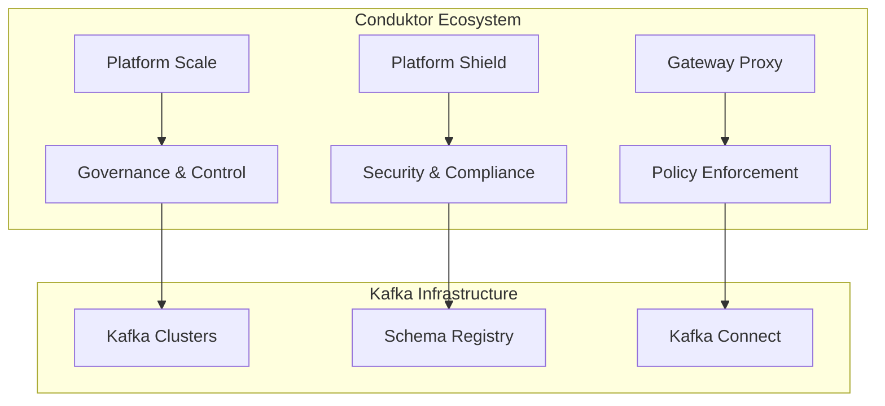
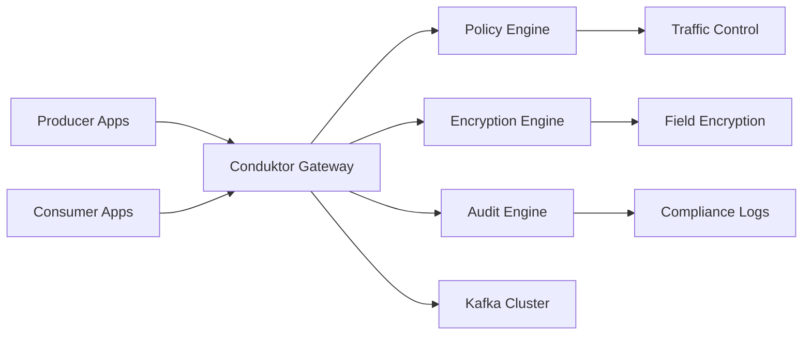

# Chapitre 5 : Conduktor - Plateforme Enterprise de Management Kafka

## Introduction

Conduktor s'est imposé comme **la plateforme de référence** pour la gestion enterprise d'Apache Kafka, avec un focus unique sur la **gouvernance des données** et la **sécurité by design**. Leur approche différenciée combine management traditionnel avec des innovations en matière de contrôle d'accès, encryption native et compliance automatisée.

**Source officielle :** [docs.conduktor.io](https://docs.conduktor.io/)

## Table des matières

1. [Vue d'ensemble de l'écosystème Conduktor](#vue-densemble-de-lécosystème-conduktor)
2. [Platform Scale - Management Enterprise](#platform-scale---management-enterprise)
3. [Platform Shield - Sécurité et Compliance](#platform-shield---sécurité-et-compliance)
4. [Gateway - Proxy Kafka Avancé](#gateway---proxy-kafka-avancé)
5. [Architecture et déploiement](#architecture-et-déploiement)
6. [Cas d'usage et implémentations](#cas-dusage-et-implémentations)
7. [Comparaison concurrentielle](#comparaison-concurrentielle)
8. [ROI et justification business](#roi-et-justification-business)

---

## Vue d'ensemble de l'écosystème Conduktor

### Positionnement unique dans le marché

Conduktor se différencie par son approche **"Enterprise Data Management Platform For Streaming"** qui va au-delà du simple monitoring pour offrir une **gouvernance complète** des données en streaming.



### Philosophie produit

**Conduktor** adopte une approche **"Security & Governance First"** qui répond aux besoins enterprise :

1. **Centralisation du contrôle** : Un point d'entrée unique pour toutes les opérations Kafka
2. **Sécurité by design** : Encryption et masking natifs sans impact performance
3. **Self-service encadré** : Autonomie équipes avec guardrails enterprise
4. **Compliance automatisée** : Respect réglementaire sans friction développement

---

## Platform Scale - Management Enterprise

### Vue d'ensemble Scale

**Platform Scale** constitue le cœur de la solution Conduktor pour la **scalabilité et le contrôle** des environnements Kafka enterprise.

#### Fonctionnalités clés Scale

**1. RBAC Avancé (Role-Based Access Control)**
```yaml
# Configuration RBAC Conduktor
rbac:
  roles:
    - name: "kafka-admin"
      permissions:
        - "cluster:read"
        - "cluster:write" 
        - "topic:create"
        - "topic:delete"
        
    - name: "developer"
      permissions:
        - "topic:read"
        - "topic:write"
      restrictions:
        topics: "team-*"
        
    - name: "analyst"
      permissions:
        - "topic:read"
      restrictions:
        topics: "analytics-*"
```

**2. Self-service Quickstart**

Portails libre-service permettant aux équipes de déployer rapidement sans intervention ops :

```python
# API Self-service Conduktor
class SelfServicePortal:
    def __init__(self):
        self.conduktor_client = ConduktorClient()
        
    def request_topic(self, team_name, topic_config):
        """Demande de création de topic avec validation automatique"""
        request = {
            "team": team_name,
            "topic_name": f"{team_name}-{topic_config['name']}",
            "partitions": topic_config.get('partitions', 3),
            "replication_factor": topic_config.get('replication', 3),
            "retention_hours": topic_config.get('retention', 168),
            "business_justification": topic_config['justification']
        }
        
        # Validation automatique des policies
        validation_result = self.conduktor_client.validate_topic_request(request)
        
        if validation_result.approved:
            return self.conduktor_client.create_topic(request)
        else:
            return {"status": "pending_approval", "reason": validation_result.reason}
```

**3. Traffic Control Policies**

Gestion fine du trafic avec quotas et throttling :

```yaml
# Policies de contrôle trafic
traffic_policies:
  - name: "production-quota"
    targets:
      environments: ["prod"]
    limits:
      producer_byte_rate: "10MB/s"
      consumer_byte_rate: "50MB/s"
      request_rate: "1000/s"
      
  - name: "development-limits"
    targets:
      environments: ["dev", "staging"]
    limits:
      producer_byte_rate: "1MB/s"
      max_topics_per_team: 10
```

**4. Monitoring & Alerting Enterprise**

Observabilité complète avec dashboards personnalisés :

```python
class ConduktorMonitoring:
    def __init__(self):
        self.dashboard_builder = DashboardBuilder()
        
    def create_business_dashboard(self):
        """Création de dashboards business-oriented"""
        dashboard = self.dashboard_builder.create_dashboard("Business Metrics")
        
        # Métriques business
        dashboard.add_widget("topic_usage_by_team", {
            "type": "bar_chart",
            "metric": "kafka.topic.bytes_in",
            "group_by": "team",
            "time_range": "7d"
        })
        
        dashboard.add_widget("sla_compliance", {
            "type": "gauge",
            "metric": "kafka.consumer.lag_max",
            "threshold": {"warning": 1000, "critical": 5000}
        })
        
        # Alerting intelligent
        dashboard.add_alert("high_consumer_lag", {
            "condition": "kafka.consumer.lag_max > 10000",
            "duration": "5m",
            "channels": ["slack", "pagerduty"],
            "escalation": "team_lead"
        })
        
        return dashboard
```

### Kafka Resource Management

Gestion centralisée des ressources avec lifecycle management :

```python
class ResourceLifecycleManager:
    def __init__(self):
        self.conduktor_api = ConduktorAPI()
        
    def manage_topic_lifecycle(self):
        """Gestion automatisée du cycle de vie des topics"""
        
        # Identification des topics non utilisés
        unused_topics = self.identify_unused_topics(days_threshold=30)
        
        for topic in unused_topics:
            # Notification équipes propriétaires
            self.notify_topic_owner(topic, "cleanup_notice")
            
            # Grace period avant archivage
            self.schedule_topic_archive(topic, delay_days=7)
            
    def capacity_planning(self):
        """Planification capacité basée sur tendances"""
        growth_trends = self.analyze_growth_trends()
        
        recommendations = []
        for cluster in growth_trends:
            if cluster.projected_growth > 0.8:  # 80% capacity
                recommendations.append({
                    "cluster": cluster.name,
                    "action": "scale_up",
                    "timeline": "next_30_days",
                    "additional_brokers": self.calculate_needed_brokers(cluster)
                })
                
        return recommendations
```

---

## Platform Shield - Sécurité et Compliance

### Vue d'ensemble Shield

**Platform Shield** révolutionne la sécurité Kafka avec une approche **"Security by Design"** qui intègre encryption, masking et compliance de manière transparente.

#### Innovations Shield

**1. Encryption Native**

Chiffrement au niveau applicatif sans impact architecture :

```python
class ShieldEncryption:
    def __init__(self):
        self.shield_client = ShieldClient()
        self.key_manager = KeyManager()
        
    def configure_field_encryption(self, topic_schema):
        """Configuration du chiffrement au niveau des champs"""
        encryption_config = {
            "topic": topic_schema.topic_name,
            "fields": [
                {
                    "name": "credit_card_number",
                    "encryption": "AES-256-GCM",
                    "key_rotation": "monthly",
                    "deterministic": False  # Pour éviter frequency analysis
                },
                {
                    "name": "social_security_number", 
                    "encryption": "Format-Preserving-Encryption",
                    "preserve_format": True,
                    "key_rotation": "quarterly"
                }
            ]
        }
        
        return self.shield_client.apply_encryption_policy(encryption_config)
    
    def transparent_decryption(self, consumer_group, authorized_fields):
        """Décryptage transparent pour consommateurs autorisés"""
        decryption_policy = {
            "consumer_group": consumer_group,
            "authorized_fields": authorized_fields,
            "audit_access": True,
            "time_window": "business_hours"  # Restriction temporelle
        }
        
        return self.shield_client.configure_transparent_decryption(decryption_policy)
```

**2. Data Masking Intelligent**

Pseudonymisation et anonymisation automatique :

```python
class IntelligentDataMasking:
    def __init__(self):
        self.masking_engine = MaskingEngine()
        
    def configure_adaptive_masking(self):
        """Configuration du masking adaptatif selon l'environnement"""
        masking_rules = {
            "environments": {
                "production": {
                    "mask_level": "none",  # Données réelles pour production
                    "audit_required": True
                },
                "staging": {
                    "mask_level": "partial",  # Masking partiel
                    "rules": ["mask_pii", "preserve_format"]
                },
                "development": {
                    "mask_level": "full",  # Masking complet
                    "rules": ["anonymize_all", "synthetic_data"]
                }
            },
            "role_based_masking": {
                "data_scientist": ["unmask_analytics_fields"],
                "developer": ["mask_all_pii"],
                "tester": ["synthetic_data_only"]
            }
        }
        
        return self.masking_engine.apply_rules(masking_rules)
```

**3. Audit Complet et Exportable**

Logs d'audit conformes aux réglementations :

```python
class ComplianceAuditing:
    def __init__(self):
        self.audit_engine = AuditEngine()
        
    def configure_gdpr_audit(self):
        """Configuration audit GDPR/CCPA"""
        audit_config = {
            "regulations": ["GDPR", "CCPA", "SOX"],
            "audit_events": [
                "data_access",
                "data_modification", 
                "data_export",
                "permission_changes",
                "policy_modifications"
            ],
            "retention_policy": {
                "audit_logs": "7_years",
                "export_format": ["JSON", "CSV", "SIEM"],
                "encryption": "AES-256"
            },
            "real_time_monitoring": {
                "suspicious_access_patterns": True,
                "bulk_data_exports": True,
                "off_hours_access": True
            }
        }
        
        return self.audit_engine.configure_compliance(audit_config)
    
    def generate_compliance_report(self, regulation_type, date_range):
        """Génération de rapports de compliance"""
        report = self.audit_engine.generate_report({
            "regulation": regulation_type,
            "period": date_range,
            "include_sections": [
                "data_lineage",
                "access_patterns", 
                "policy_violations",
                "remediation_actions"
            ]
        })
        
        return report
```

**4. Dynamic Header Injection**

Enrichissement automatique des messages pour la traçabilité :

```yaml
# Configuration injection headers
header_injection:
  rules:
    - name: "audit_trail"
      inject_headers:
        - name: "x-user-id"
          source: "authenticated_user"
        - name: "x-source-system"
          source: "producer_client_id"
        - name: "x-timestamp"
          source: "current_timestamp"
        - name: "x-audit-id"
          source: "generate_uuid"
          
    - name: "compliance_markers"
      conditions:
        topic_pattern: "pii-*"
      inject_headers:
        - name: "x-data-classification"
          value: "PII"
        - name: "x-retention-policy"
          value: "delete_after_2_years"
```

---

## Gateway - Proxy Kafka Avancé

### Architecture Gateway

Le **Conduktor Gateway** agit comme un proxy intelligent entre les applications et Kafka, permettant l'application de politiques sans modification du code applicatif.



### Fonctionnalités Gateway avancées

**1. SNI Routing pour Multi-tenancy**

```yaml
# Configuration SNI Routing
sni_routing:
  clusters:
    - name: "tenant-a-cluster"
      sni_hostname: "tenant-a.kafka.company.com"
      kafka_bootstrap: "kafka-a:9092"
      
    - name: "tenant-b-cluster" 
      sni_hostname: "tenant-b.kafka.company.com"
      kafka_bootstrap: "kafka-b:9092"
      
  routing_rules:
    - match:
        client_certificate_cn: "tenant-a-*"
      route_to: "tenant-a-cluster"
      
    - match:
        client_certificate_cn: "tenant-b-*"
      route_to: "tenant-b-cluster"
```

**2. Failover Automatique**

```python
class GatewayFailover:
    def __init__(self):
        self.health_checker = HealthChecker()
        self.route_manager = RouteManager()
        
    def configure_intelligent_failover(self):
        """Configuration du failover intelligent"""
        failover_config = {
            "primary_cluster": {
                "bootstrap_servers": "kafka-primary:9092",
                "health_check_interval": "5s",
                "failure_threshold": 3
            },
            "secondary_cluster": {
                "bootstrap_servers": "kafka-secondary:9092", 
                "auto_failback": True,
                "failback_delay": "2m"
            },
            "failover_triggers": [
                "broker_unavailable",
                "high_latency",
                "partition_leader_election_failure"
            ]
        }
        
        return self.route_manager.configure_failover(failover_config)
```

---

## Cas d'usage et implémentations

### Cas d'usage 1 : Finance - Conformité PCI DSS

```python
class FinancialComplianceSetup:
    def __init__(self):
        self.conduktor = ConduktorClient()
        
    def setup_pci_compliance(self):
        """Configuration complète PCI DSS"""
        
        # 1. Encryption obligatoire cartes de crédit
        self.conduktor.shield.configure_encryption({
            "topics": ["payments", "transactions"],
            "fields": ["card_number", "cvv", "expiry_date"],
            "encryption": "AES-256-GCM",
            "key_rotation": "quarterly"
        })
        
        # 2. Audit trail complet
        self.conduktor.audit.enable_pci_audit({
            "log_all_access": True,
            "retention": "10_years",
            "export_format": "SIEM_compatible"
        })
        
        # 3. Access control strict
        self.conduktor.rbac.configure_pci_access({
            "payment_processors": ["read", "write"],
            "compliance_team": ["read", "audit"],
            "developers": ["no_access_prod"]
        })
```

### Cas d'usage 2 : E-commerce - Self-service Teams

```python
class EcommerceTeamPortal:
    def __init__(self):
        self.portal = ConduktorSelfService()
        
    def configure_team_autonomy(self):
        """Configuration portail self-service e-commerce"""
        
        teams_config = {
            "recommendations_team": {
                "allowed_topics": "recommendations-*",
                "max_partitions": 20,
                "retention_max": "7_days",
                "throughput_quota": "100MB/s"
            },
            "analytics_team": {
                "allowed_topics": "analytics-*", 
                "max_partitions": 50,
                "retention_max": "90_days",
                "throughput_quota": "500MB/s"
            }
        }
        
        for team, config in teams_config.items():
            self.portal.create_team_environment(team, config)
```

### Cas d'usage 3 : Healthcare - HIPAA Compliance

```python
class HealthcareCompliance:
    def __init__(self):
        self.hipaa_manager = HIPAAComplianceManager()
        
    def setup_hipaa_environment(self):
        """Configuration environnement HIPAA"""
        
        # Chiffrement PHI (Protected Health Information)
        phi_encryption = {
            "patient_data_topics": ["patient-records", "medical-data"],
            "encryption_level": "field_level",
            "algorithms": "FIPS_140_2_approved",
            "key_management": "AWS_CloudHSM"
        }
        
        # Audit HIPAA
        hipaa_audit = {
            "minimum_necessary_access": True,
            "access_logging": "comprehensive",
            "breach_detection": "real_time",
            "reporting": "automated_monthly"
        }
        
        return self.hipaa_manager.configure(phi_encryption, hipaa_audit)
```

---

## Comparaison concurrentielle

### Conduktor vs Confluent Control Center

| Fonctionnalité | Conduktor | Confluent Control Center |
|----------------|-----------|-------------------------|
| **RBAC granulaire** | ⭐⭐⭐⭐⭐ | ⭐⭐⭐ |
| **Encryption native** | ⭐⭐⭐⭐⭐ | ⭐⭐ |
| **Self-service portals** | ⭐⭐⭐⭐⭐ | ⭐⭐ |
| **Compliance automation** | ⭐⭐⭐⭐⭐ | ⭐⭐⭐ |
| **Gateway proxy** | ⭐⭐⭐⭐⭐ | ❌ |
| **Multi-cluster support** | ⭐⭐⭐⭐ | ⭐⭐⭐⭐⭐ |
| **Pricing** | $$$ | $$$$ |

### Conduktor vs Kafdrop/AKHQ

| Aspect | Conduktor | Open Source (Kafdrop/AKHQ) |
|--------|-----------|---------------------------|
| **Enterprise features** | Complet | Limité |
| **Security** | Enterprise-grade | Basique |
| **Support** | 24/7 Commercial | Communauté |
| **Compliance** | GDPR/SOX/HIPAA ready | Manuel |
| **Cost** | Licence payante | Gratuit |
| **Deployment** | SaaS ou On-premises | Self-hosted |

---

## ROI et justification business

### Calcul ROI Conduktor

**Coûts évités :**

```python
class ConduktorROICalculator:
    def calculate_annual_savings(self, organization_size):
        """Calcul des économies annuelles avec Conduktor"""
        
        # Réduction équipe ops
        ops_savings = {
            "kafka_admin_fte": 2,  # 2 FTE évités
            "annual_salary_per_fte": 120000,
            "total_ops_savings": 240000
        }
        
        # Évitement incidents sécurité
        security_savings = {
            "data_breach_probability_reduction": 0.85,
            "average_breach_cost": 4000000,
            "expected_savings": 3400000
        }
        
        # Compliance automation
        compliance_savings = {
            "audit_preparation_hours": 2000,
            "hourly_rate_compliance": 200,
            "annual_compliance_savings": 400000
        }
        
        # Productivité développeurs
        developer_productivity = {
            "developers_count": organization_size.get('developers', 50),
            "time_saved_per_dev_per_year": 40,  # heures
            "hourly_rate_developer": 100,
            "productivity_savings": 50 * 40 * 100  # 200,000
        }
        
        total_savings = (
            ops_savings["total_ops_savings"] +
            security_savings["expected_savings"] +
            compliance_savings["annual_compliance_savings"] + 
            developer_productivity["productivity_savings"]
        )
        
        return {
            "total_annual_savings": total_savings,
            "breakdown": {
                "ops_reduction": ops_savings["total_ops_savings"],
                "security_risk_mitigation": security_savings["expected_savings"],
                "compliance_automation": compliance_savings["annual_compliance_savings"],
                "developer_productivity": developer_productivity["productivity_savings"]
            }
        }
```

### Business Case Type

**Organisation 500+ développeurs :**
- **Coût Conduktor** : ~$300K/an
- **Économies totales** : ~$4M/an  
- **ROI** : 1,233% sur 3 ans
- **Payback period** : 2.7 mois

---

## Conclusion

Conduktor se positionne comme **la solution de référence** pour les organisations enterprise qui cherchent à industrialiser Kafka avec un focus **sécurité et gouvernance**.

**Points forts uniques :**
- **Security by Design** avec encryption transparente
- **Compliance automation** pour GDPR/HIPAA/SOX
- **Self-service** encadré pour autonomie équipes
- **Gateway proxy** pour policies sans code changes

**Recommandation :** Conduktor est particulièrement adapté aux **secteurs régulés** (finance, healthcare, gouvernement) et aux **grandes organisations** ayant des besoins de gouvernance avancée.

La plateforme représente un investissement stratégique qui transforme Kafka d'un outil technique en **infrastructure de gouvernance des données** enterprise-ready.

---

*Sources : [docs.conduktor.io](https://docs.conduktor.io/), retours clients enterprise, analyses TCO 2024-2025* 