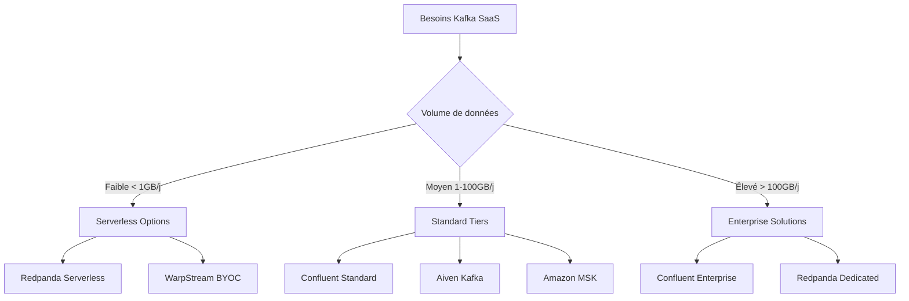

# Chapitre 7 : Solutions SaaS Kafka - L'Écosystème Cloud

## Vue d'ensemble

Le marché des solutions Kafka SaaS (Software-as-a-Service) a explosé ces dernières années, offrant des alternatives puissantes à l'auto-hébergement d'Apache Kafka. Ces solutions permettent aux organisations de bénéficier de la puissance de Kafka sans la complexité opérationnelle.

## 🌟 Principales Solutions SaaS

### 1. **Confluent Cloud** - Le Leader du Marché

**Créé par les fondateurs originaux de Kafka**

#### Caractéristiques Clés
- **Plateforme native cloud** optimisée avec le moteur Kora
- **10x d'élasticité** par rapport à Kafka traditionnel
- **Compatibilité complète** avec l'écosystème Kafka
- **99.99% SLA** pour tous les composants

#### Fonctionnalités Avancées
```yaml
Services Inclus:
  - Apache Kafka managé
  - Apache Flink serverless
  - Schema Registry
  - 80+ connecteurs managés
  - ksqlDB pour le stream processing
  - Cluster Linking pour la réplication
```

#### Modèles de Déploiement
1. **Basic** - Développement et tests
2. **Standard** - Production avec SLA
3. **Dedicated** - Clusters dédiés
4. **Enterprise** - Fonctionnalités avancées

#### Avantages
- ✅ Support 24/7 par les experts Kafka
- ✅ Auto-scaling intelligent
- ✅ Sécurité enterprise (RBAC, SSO, chiffrement)
- ✅ Conformité (SOC 2, HIPAA, GDPR)

#### Pricing
- **Pay-as-you-go** ou volume discounts
- Tarification basée sur le débit et le stockage
- Calculateur de coûts disponible

---

### 2. **Redpanda Cloud** - Performance et Simplicité

**Architecture C++ sans JVM ni ZooKeeper**

#### Innovations Technologiques
- **Thread-per-core architecture** pour performance maximale
- **10x latence plus faible** que Kafka traditionnel
- **6x réduction TCO** vs infrastructure Kafka
- **Architecture single-binary** simplifiée

#### Modèles de Service
```yaml
Redpanda Serverless:
  - Création instantanée
  - Pay-per-request
  - Auto-scaling
  - 14 jours gratuits ($100 crédits)

Redpanda BYOC:
  - Déploiement dans votre VPC
  - Contrôle total
  - Isolation sécurisée
  - Support multi-cloud

Redpanda Dedicated:
  - Clusters single-tenant
  - Performance garantie
  - SLA 99.99%
```

#### Cas d'Usage Optimaux
- 🎯 Applications haute performance
- 🎯 Charges de travail 10GB/s+
- 🎯 Gaming et temps réel
- 🎯 Trading financier

#### Retours Clients
> "Redpanda nous a permis de passer de centaines de millions à milliards de dollars de trading par jour avec un traitement 100x plus rapide" - Alpaca

---

### 3. **Amazon MSK (Managed Streaming for Kafka)**

**Service Kafka entièrement managé d'AWS**

#### Versions Disponibles
1. **MSK Provisioned** - Clusters traditionnels
2. **MSK Serverless** - Auto-scaling complet
3. **MSK Connect** - Connecteurs managés

#### Intégrations AWS Natives
```yaml
Services Intégrés:
  - IAM pour l'authentification
  - VPC pour le réseau
  - CloudWatch pour le monitoring
  - KMS pour le chiffrement
  - Lambda pour les triggers
```

#### Avantages AWS
- ✅ Intégration transparente écosystème AWS
- ✅ Pas de frais inter-AZ pour la réplication
- ✅ Scaling automatique (MSK Serverless)
- ✅ Sécurité AWS native

#### Limitations
- ❌ Lock-in AWS
- ❌ Coûts élevés à grande échelle
- ❌ Moins de flexibilité que Confluent

---

### 4. **Aiven for Apache Kafka**

**Plateforme multi-cloud européenne**

#### Propositions de Valeur
- **Multi-cloud native** (AWS, GCP, Azure)
- **Dashboard simplifié** pour la gestion
- **Scaling flexible** sans interruption
- **Support DevOps** intégré

#### Fonctionnalités Distinctives
```yaml
Gestion Simplifiée:
  - Provisioning en quelques clics
  - Migration inter-cloud
  - Upgrades sans downtime
  - Monitoring intégré

Sécurité:
  - Chiffrement end-to-end
  - VPC peering
  - Private Link
  - Conformité GDPR
```

#### Points Forts
- 🌍 Présence européenne forte
- 🔧 Outils de gestion intuitifs
- 🔄 Migrations cloud simplifiées
- 📊 Monitoring avancé

---

### 5. **WarpStream** - Architecture Révolutionnaire

**Platform Kafka sans disques, basé sur Object Storage**

#### Innovation Architecturale
- **Zero disks** - Stockage directement sur S3/GCS
- **10x moins cher** que Kafka traditionnel
- **Pas de frais inter-AZ** grâce à l'object storage
- **Scaling infini** sans rebalancing

#### Modèle BYOC (Bring Your Own Cloud)
```yaml
Architecture WarpStream:
  - Agents stateless dans votre VPC
  - Stockage sur votre object storage
  - Control plane managé par WarpStream
  - Données ne quittent jamais votre environnement
```

#### Avantages Économiques
- 💰 **4-10x réduction des coûts** vs Kafka self-hosted
- 💰 Pas de frais de bande passante inter-AZ
- 💰 Pricing basé sur l'usage réel
- 💰 Storage au coût de l'object storage

#### Cas d'Usage Idéaux
- 📊 Workloads à coût variable
- 📊 Analytics et data lakes
- 📊 Charges intermittentes
- 📊 Conformité stricte

#### Benchmarks Publics
```
Performance (avec 6 instances m6in.4xl):
- Throughput: 1 GiB/s writes + 3 GiB/s reads
- Latency P99: <2s end-to-end
- Cost: $12,868/mois vs $54,591/mois (Kafka)
- Scaling: Automatique sans partition rebalancing
```

---

### 6. **Upstash Kafka** ⚠️ (Déprécié)

**Note Importante : Upstash a annoncé la dépréciation de leur service Kafka en septembre 2024**

#### Historique
- **Premier service Kafka serverless** (2021)
- **Pricing par requête** révolutionnaire
- **Support REST API** natif
- **Dépréciation annoncée** - arrêt mars 2025

#### Raisons de la Dépréciation
- Focus sur Upstash QStash et Workflow
- Complexité du marché Kafka
- Concurrence intense

#### Alternatives Recommandées
```yaml
Migrations Suggérées:
  - Vers Confluent Cloud (compatibilité)
  - Vers Redpanda Serverless (simplicité)
  - Vers WarpStream (économies)
  - Vers Aiven (multi-cloud)
```

---

## 📊 Comparaison Détaillée des Solutions

### Matrice de Fonctionnalités

| Solution | Serverless | Multi-Cloud | API REST | TCO | Latence | Support |
|----------|------------|-------------|----------|-----|---------|---------|
| **Confluent Cloud** | ✅ | ✅ | ✅ | 💰💰💰 | 🟢 | ⭐⭐⭐⭐⭐ |
| **Redpanda Cloud** | ✅ | ✅ | ✅ | 💰💰 | 🟢🟢 | ⭐⭐⭐⭐ |
| **Amazon MSK** | ✅ | ❌ | ✅ | 💰💰💰 | 🟢 | ⭐⭐⭐⭐ |
| **Aiven** | ❌ | ✅ | ✅ | 💰💰 | 🟢 | ⭐⭐⭐⭐ |
| **WarpStream** | ✅ | ✅ | ✅ | 💰 | 🟡 | ⭐⭐⭐ |

### Critères de Sélection

#### Pour les Startups
```yaml
Recommandations:
  1. Redpanda Serverless - Simplicité et performance
  2. WarpStream - Coûts minimaux
  3. Confluent Cloud Basic - Écosystème complet
```

#### Pour les Entreprises
```yaml
Recommandations:
  1. Confluent Cloud Enterprise - Support et conformité
  2. Amazon MSK - Si écosystème AWS
  3. Aiven - Si multi-cloud requis
```

#### Pour les Applications Haute Performance
```yaml
Recommandations:
  1. Redpanda Dedicated - Performance maximale
  2. Confluent Cloud Dedicated - Support expert
  3. WarpStream Pro - Cost-effective haute disponibilité
```

---

## 🚀 Tendances et Évolutions 2024-2025

### Innovations Majeures

1. **Serverless Natif**
   - Scaling automatique instantané
   - Pay-per-request pricing
   - Zero administration

2. **Object Storage Integration**
   - Tiered storage automatique
   - Coûts de stockage réduits
   - Rétention quasi-infinie

3. **AI/ML Integration**
   - Vector databases intégrées
   - Stream processing pour ML
   - Real-time feature stores

4. **Multi-Cloud et Edge**
   - Déploiements edge
   - Réplication globale
   - Latence optimisée

### Convergence des Standards

```yaml
Standards Émergents:
  - Kafka Protocol compatibility
  - OpenTelemetry monitoring
  - Schema Registry standards
  - Cloud-native deployments
```

---

## 🎯 Guide de Sélection

### Questions Clés

1. **Quel est votre volume de données ?**
   - < 1GB/jour → Serverless
   - 1-100GB/jour → Standard/Dedicated
   - > 100GB/jour → Enterprise solutions

2. **Quels sont vos besoins de latence ?**
   - < 100ms → Redpanda, Confluent Dedicated
   - < 1s → Solutions standards
   - > 1s → WarpStream acceptable

3. **Quel est votre budget ?**
   - Budget serré → WarpStream, Redpanda Serverless
   - Budget moyen → Aiven, Confluent Standard
   - Budget large → Confluent Enterprise

4. **Avez-vous des contraintes de conformité ?**
   - Oui → Confluent, Amazon MSK
   - Modérées → Aiven, Redpanda
   - Non → WarpStream

### Matrice de Décision



---

## 📈 ROI et Justification Business

### Calcul du TCO (Total Cost of Ownership)

#### Self-Hosted vs SaaS
```yaml
Coûts Self-Hosted (estimation):
  Infrastructure: $50,000/an
  Operations: $150,000/an (2 FTE)
  Maintenance: $30,000/an
  Total: $230,000/an

Coûts SaaS (estimation):
  Confluent Cloud: $80,000/an
  Redpanda Cloud: $60,000/an
  WarpStream: $40,000/an
  
Économies: 65-85% selon la solution
```

### Bénéfices Intangibles
- 🎯 **Time-to-market** réduit de 6-12 mois
- 🎯 **Focus équipe** sur le business logic
- 🎯 **Réduction des risques** opérationnels
- 🎯 **Scaling automatique** selon la demande

---

## 🔮 Perspectives d'Avenir

### Prédictions 2025-2026

1. **Consolidation du Marché**
   - Rachats de petits acteurs
   - Standardisation des APIs
   - Emergence de leaders clairs

2. **Nouvelles Architectures**
   - Serverless-first design
   - Edge computing integration
   - AI-native features

3. **Évolution des Prix**
   - Guerre des prix continue
   - Modèles consumption-based
   - Free tiers étendus

### Recommandations Stratégiques

```yaml
Stratégie à Long Terme:
  - Éviter le vendor lock-in
  - Prioriser la compatibilité Kafka
  - Investir dans la montée en compétences
  - Planifier la multi-cloud strategy
```

---

## 📚 Ressources et Documentation

### Sources Officielles
- [Confluent Cloud Documentation](https://docs.confluent.io/cloud/)
- [Redpanda Cloud Docs](https://docs.redpanda.com/docs/deploy/deployment-option/cloud/)
- [Amazon MSK User Guide](https://docs.aws.amazon.com/msk/)
- [Aiven Kafka Docs](https://docs.aiven.io/docs/products/kafka)
- [WarpStream Documentation](https://docs.warpstream.com/)

### Benchmarks et Comparaisons
- [WarpStream Public Benchmarks](https://www.warpstream.com/blog/warpstream-benchmarks-and-tco)
- [Redpanda vs Confluent Performance Report](https://redpanda.com/redpanda-vs-confluent)
- [Top Kafka Providers 2024 Analysis](https://risingwave.com/blog/top-kafka-providers-2024-edition/)

### Communautés et Support
- [Confluent Community Slack](https://launchpass.com/confluentcommunity)
- [Redpanda Community](https://redpanda.com/slack)
- [WarpStream Community](https://www.warpstream.com/slack)

---

*Ce chapitre sera mis à jour régulièrement avec les dernières évolutions du marché SaaS Kafka.* 