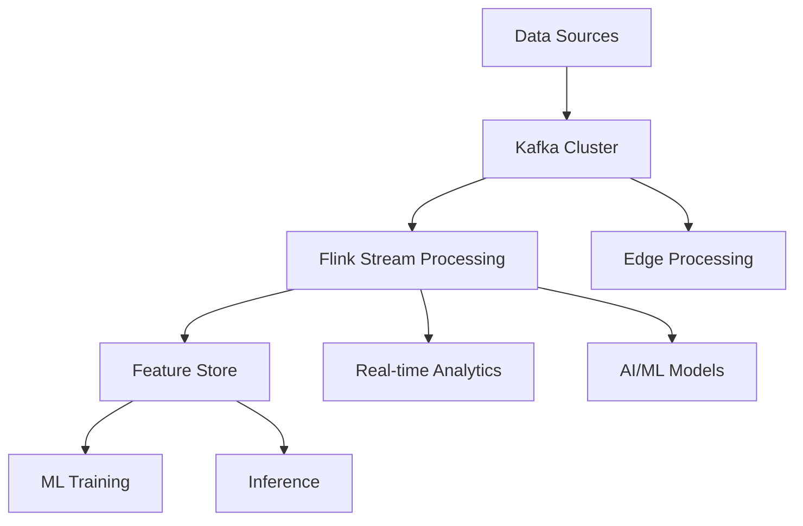
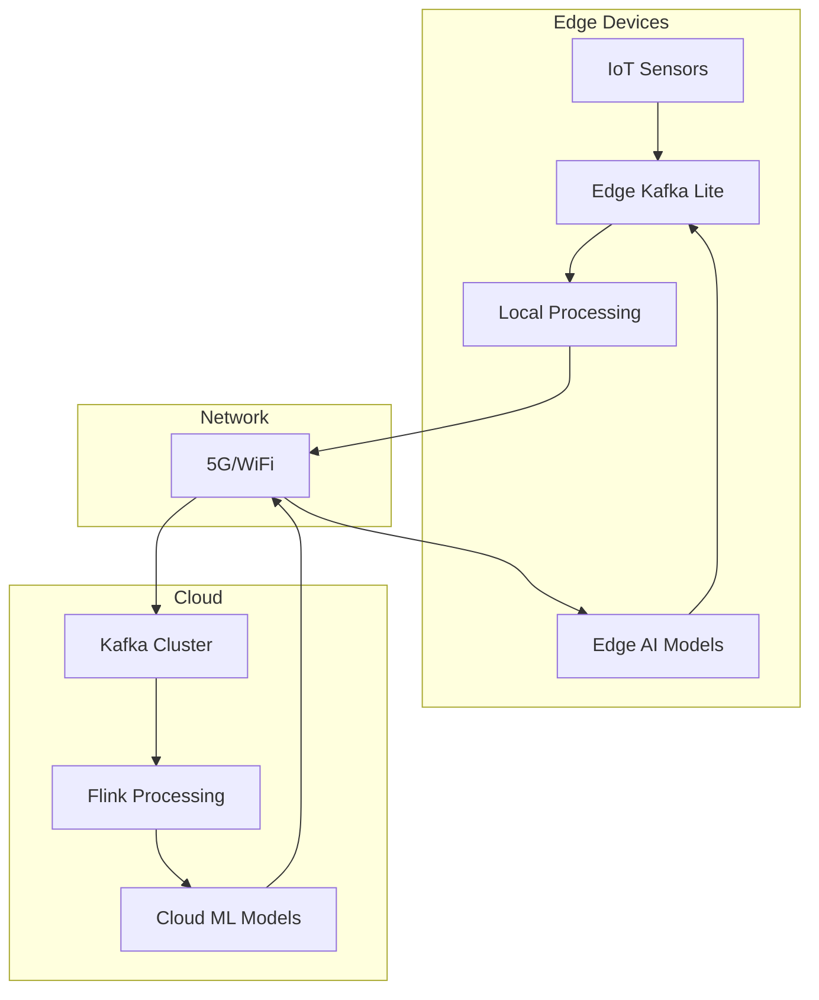
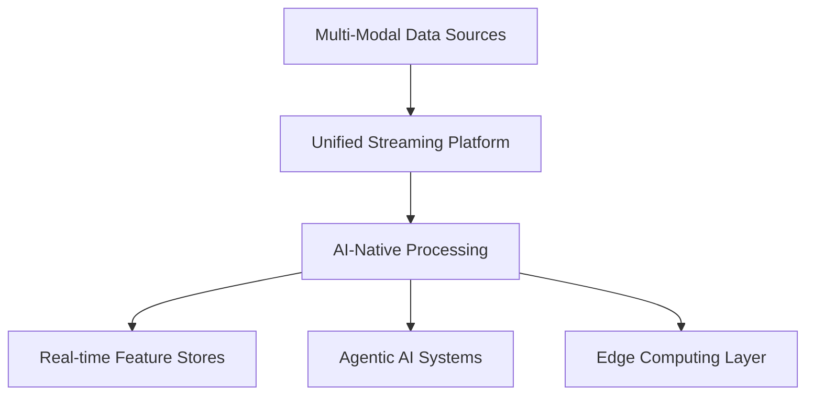

# Chapitre 9 : Stream Processing Avancé avec Kafka et Flink

## Introduction

Le stream processing représente l'évolution naturelle des architectures de données modernes, permettant de traiter des événements en temps réel pour des applications critiques. Ce chapitre explore les aspects avancés du stream processing avec Apache Kafka et Apache Flink, deux technologies qui redéfinissent la manière dont les entreprises gèrent leurs données en temps réel.

## Table des matières

1. [Architecture Stream Processing Moderne](#architecture-stream-processing-moderne)
2. [Apache Flink : Le moteur de référence](#apache-flink-le-moteur-de-référence)
3. [Patterns de Stream Processing](#patterns-de-stream-processing)
4. [Edge Computing et Streaming](#edge-computing-et-streaming)
5. [Feature Stores en Temps Réel](#feature-stores-en-temps-réel)
6. [Agentic AI et Stream Processing](#agentic-ai-et-stream-processing)
7. [IoT et MQTT Integration](#iot-et-mqtt-integration)
8. [Cas d'usage sectoriels](#cas-dusage-sectoriels)
9. [Performance et Optimisation](#performance-et-optimisation)
10. [Observabilité et Monitoring](#observabilité-et-monitoring)

---

## Architecture Stream Processing Moderne

### L'évolution vers le temps réel

L'architecture moderne de stream processing répond aux limitations des systèmes batch traditionnels :



### Composants essentiels

**1. Ingestion Layer (Kafka)**
- **Kafka Topics** : Partitionnement intelligent pour la scalabilité
- **Schema Registry** : Governance et évolution des schémas
- **Kafka Connect** : Connecteurs pour sources et sinks diverses

**2. Processing Layer (Flink)**
- **Stream Processing** : Traitement en temps réel avec état
- **Complex Event Processing (CEP)** : Détection de patterns
- **Windowing** : Agrégations temporelles

**3. Serving Layer**
- **Feature Stores** : Stockage des features ML
- **Vector Databases** : Recherche de similarité
- **Real-time APIs** : Exposition des résultats

---

## Apache Flink : Le moteur de référence

### Pourquoi Flink domine le stream processing

Selon les dernières tendances 2024-2025, **Apache Flink est devenu le standard de facto** pour le stream processing avancé :

#### Avantages techniques
- **True Streaming** : Contrairement à Spark qui utilise des micro-batches
- **Low Latency** : Traitement en millisecondes 
- **Stateful Processing** : Gestion d'état distribuée native
- **Exactly-Once Semantics** : Garanties de livraison forte
- **Fault Tolerance** : Récupération automatique via checkpoints

#### Comparaison Flink vs Spark Streaming

| Aspect | Flink | Spark Streaming |
|--------|-------|----------------|
| **Architecture** | Native streaming | Micro-batches |
| **Latency** | < 10ms | 100ms - 1s |
| **State Management** | Native distributed | Complexe à gérer |
| **Fault Recovery** | Checkpoints/Savepoints | RDD lineage |
| **APIs** | Java, Scala, Python, SQL | Java, Scala, Python |

### Flink 2.0 : Innovations 2024-2025

**Nouvelles fonctionnalités clés :**

1. **Adaptive Batch Scheduling** : Optimisation automatique
2. **Unified Batch-Stream APIs** : API unique pour tous les cas
3. **Improved State Backends** : Performance accrue pour l'état
4. **Enhanced SQL Support** : SQL plus riche pour le streaming
5. **Cloud-Native Deployment** : Intégration Kubernetes native

---

## Patterns de Stream Processing

### 1. Shift Left Architecture

Le **Shift Left Pattern** révolutionne la manière de traiter les données :

```python
# Pattern Shift Left avec Flink
from pyflink.datastream import StreamExecutionEnvironment
from pyflink.datastream.connectors import FlinkKafkaConsumer, FlinkKafkaProducer

def shift_left_pipeline():
    env = StreamExecutionEnvironment.get_execution_environment()
    
    # 1. Ingestion en temps réel
    raw_stream = env.add_source(
        FlinkKafkaConsumer("raw-events", SimpleStringSchema(), kafka_props)
    )
    
    # 2. Transformation immédiate (Shift Left)
    processed_stream = (raw_stream
        .map(parse_event)
        .filter(validate_event)
        .key_by("user_id")
        .window(TumblingEventTimeWindows.of(Time.minutes(5)))
        .aggregate(UserFeatureAggregator())
    )
    
    # 3. Distribution vers multiple sinks
    processed_stream.add_sink(
        FlinkKafkaProducer("features", feature_schema, kafka_props)
    )
    
    env.execute("Shift Left Pipeline")
```

### 2. Event-Driven Feature Engineering

Construction de features ML en temps réel :

```python
class RealTimeFeatureStore:
    def __init__(self):
        self.env = StreamExecutionEnvironment.get_execution_environment()
        
    def create_user_features(self):
        # Stream de transactions
        transactions = self.get_kafka_stream("transactions")
        
        # Features temps réel
        user_features = (transactions
            .key_by("user_id")
            .window(SlidingEventTimeWindows.of(
                Time.hours(1), Time.minutes(5)
            ))
            .apply(lambda key, window, values, out: {
                "user_id": key,
                "total_amount": sum(v.amount for v in values),
                "transaction_count": len(values),
                "avg_amount": sum(v.amount for v in values) / len(values),
                "timestamp": window.max_timestamp()
            })
        )
        
        return user_features
```

### 3. Complex Event Processing (CEP)

Détection de patterns complexes pour la fraude :

```python
from pyflink.cep import CEP, Pattern

def fraud_detection_pattern():
    # Pattern de détection de fraude
    pattern = (Pattern.begin("normal")
        .where(lambda event: event.amount < 1000)
        .next("suspicious") 
        .where(lambda event: event.amount > 5000)
        .within(Time.minutes(10))
    )
    
    # Application du pattern
    fraud_stream = CEP.pattern(
        transactions.key_by("user_id"), 
        pattern
    ).select(create_fraud_alert)
    
    return fraud_stream
```

---

## Edge Computing et Streaming

### L'émergence de l'Edge Processing

**Tendances 2024-2025 :**
- **Edge-to-Cloud Architectures** : Traitement hybride
- **5G et IoT** : Débits et latences améliorés
- **AI at the Edge** : Inférence locale avec synchronisation cloud

### Architecture Edge-Cloud avec Kafka



### Implémentation Edge avec MQTT et Kafka

```python
import paho.mqtt.client as mqtt
from kafka import KafkaProducer

class EdgeDataBridge:
    def __init__(self):
        self.mqtt_client = mqtt.Client()
        self.kafka_producer = KafkaProducer(
            bootstrap_servers=['edge-kafka:9092'],
            value_serializer=lambda x: json.dumps(x).encode('utf-8')
        )
        
    def on_mqtt_message(self, client, userdata, message):
        # Traitement local immédiat
        sensor_data = json.loads(message.payload.decode())
        processed_data = self.process_locally(sensor_data)
        
        # Envoi vers Kafka local
        self.kafka_producer.send('sensor-events', processed_data)
        
        # Synchronisation cloud si nécessaire
        if self.should_sync_cloud(processed_data):
            self.sync_to_cloud(processed_data)
    
    def process_locally(self, data):
        # AI inference locale
        prediction = self.edge_model.predict(data)
        return {
            **data,
            'edge_prediction': prediction,
            'processed_at_edge': True,
            'timestamp': time.time()
        }
```

---

## Feature Stores en Temps Réel

### La révolution des Feature Stores

Les **Feature Stores** sont devenus essentiels pour le MLOps moderne. Voici les plateformes leaders 2024-2025 :

#### Comparatif des solutions

| Plateforme | Type | Points forts | Limitations |
|------------|------|-------------|-------------|
| **Tecton** | Managed | Performance, Enterprise ready | Coût élevé |
| **Feast** | Open Source | Flexibilité, communauté | Maintenance complexe |
| **Hopsworks** | Hybrid | Features riches | Courbe d'apprentissage |
| **Databricks Feature Store** | Platform | Intégration native | Lock-in |
| **Featureform** | Virtual | Architecture virtuelle | Nouveau sur le marché |

### Architecture Real-time Feature Store

```python
class StreamingFeatureStore:
    def __init__(self):
        self.kafka_env = StreamExecutionEnvironment.get_execution_environment()
        
    def create_real_time_features(self):
        # Source de données streaming
        user_events = self.kafka_env.add_source(
            FlinkKafkaConsumer("user-events", event_schema, kafka_config)
        )
        
        # Feature engineering en temps réel
        features = (user_events
            .key_by("user_id")
            .map(FeatureEngineer())
            .window(TumblingEventTimeWindows.of(Time.minutes(1)))
            .aggregate(FeatureAggregator())
        )
        
        # Stockage dual : online et offline
        features.add_sink(RedisFeatureSink())  # Online serving
        features.add_sink(IcebergFeatureSink())  # Offline training
        
        return features

class FeatureEngineer(MapFunction):
    def map(self, event):
        return {
            'user_id': event.user_id,
            'session_duration': event.timestamp - event.session_start,
            'page_views': event.page_count,
            'bounce_rate': 1 if event.page_count == 1 else 0,
            'feature_timestamp': event.timestamp
        }
```

### Feature Store Pipeline avec Fennel

**Fennel** (racheté par Databricks) propose une approche innovante :

```python
from fennel import dataset, feature_store, pipeline

@dataset
class UserEvents:
    user_id: int
    event_type: str
    timestamp: datetime
    amount: float

@feature_store
class UserFeatures:
    @pipeline
    def user_spending_features(self, events: UserEvents):
        return events.groupby('user_id').window(
            duration='1h'
        ).aggregate(
            total_spent=events.amount.sum(),
            transaction_count=events.count(),
            avg_transaction=events.amount.mean()
        )
```

---

## Agentic AI et Stream Processing

### L'ère de l'IA Agentique

**Agentic AI** représente la prochaine révolution : des systèmes autonomes capables de prendre des décisions complexes. Le streaming devient leur système nerveux.

### Model Context Protocol (MCP) et A2A

**Innovations 2024-2025 :**

1. **Model Context Protocol (MCP)** : Standard pour le contexte IA
2. **Agent-to-Agent (A2A)** : Communication inter-agents
3. **Real-time RAG** : Retrieval Augmented Generation en temps réel

### Architecture Agentic avec Kafka

```python
class AgenticAISystem:
    def __init__(self):
        self.kafka_consumer = KafkaConsumer('events', **kafka_config)
        self.mcp_client = MCPClient()
        self.vector_db = MilvusClient()
        
    def process_agentic_workflow(self):
        for message in self.kafka_consumer:
            event = json.loads(message.value)
            
            # 1. Context enrichment via MCP
            context = self.mcp_client.get_context(event)
            
            # 2. Vector similarity search
            similar_cases = self.vector_db.search(
                vectors=[event['embedding']], 
                limit=5
            )
            
            # 3. Agent decision making
            decision = self.agent.decide(
                event=event,
                context=context,
                similar_cases=similar_cases
            )
            
            # 4. Action execution
            self.execute_action(decision)
```

### Real-time RAG avec Streaming

```python
class StreamingRAGSystem:
    def __init__(self):
        self.embedding_model = SentenceTransformer('all-MiniLM-L6-v2')
        self.vector_store = Milvus(connection_args={"host": "localhost", "port": "19530"})
        
    def create_real_time_rag_pipeline(self):
        # Stream de documents en temps réel
        doc_stream = self.get_kafka_stream("documents")
        
        # Embedding en temps réel
        embedded_docs = doc_stream.map(
            lambda doc: {
                **doc,
                'embedding': self.embedding_model.encode(doc['content']).tolist()
            }
        )
        
        # Indexation continue
        embedded_docs.add_sink(VectorStoreSink(self.vector_store))
        
        return embedded_docs
```

---

## IoT et MQTT Integration

### MQTT to Kafka Bridge

L'intégration MQTT-Kafka devient standard pour l'IoT :

```python
class MQTTKafkaBridge:
    def __init__(self):
        self.mqtt_client = mqtt.Client()
        self.kafka_producer = KafkaProducer(**kafka_config)
        
    def setup_bridge(self):
        # Configuration MQTT
        self.mqtt_client.on_connect = self.on_connect
        self.mqtt_client.on_message = self.on_message
        self.mqtt_client.connect("mqtt-broker", 1883, 60)
        
    def on_message(self, client, userdata, msg):
        # Transformation et enrichissement
        iot_data = {
            'device_id': msg.topic.split('/')[-1],
            'sensor_data': json.loads(msg.payload.decode()),
            'timestamp': time.time(),
            'quality_score': self.calculate_quality(msg.payload)
        }
        
        # Envoi vers Kafka avec partitionnement intelligent
        partition = hash(iot_data['device_id']) % 10
        self.kafka_producer.send(
            'iot-events', 
            value=iot_data, 
            partition=partition
        )
```

### Edge AI avec Vector Databases

**Milvus Lite** permet l'IA vectorielle sur edge devices :

```python
class EdgeVectorAI:
    def __init__(self):
        # Milvus Lite pour edge computing
        self.local_db = milvus_lite.MilvusLite(db_path="./edge_vectors.db")
        self.ai_model = load_edge_model()
        
    def process_camera_stream(self):
        for frame in self.camera_stream():
            # AI inference locale
            features = self.ai_model.extract_features(frame)
            
            # Recherche vectorielle locale
            similar_objects = self.local_db.search(
                vectors=[features], 
                limit=3
            )
            
            # Decision locale immédiate
            action = self.decide_locally(similar_objects)
            self.execute_action(action)
            
            # Sync cloud si nécessaire
            if self.should_sync():
                self.sync_to_cloud(features, action)
```

---

## Cas d'usage sectoriels

### 1. Finance : Détection de fraude temps réel

```python
class FraudDetectionPipeline:
    def create_fraud_pipeline(self):
        # Stream de transactions
        transactions = self.get_kafka_stream("transactions")
        
        # Features en temps réel
        enriched = (transactions
            .key_by("user_id")
            .connect(self.get_user_profile_stream())
            .flat_map(TransactionEnricher())
        )
        
        # Modèle ML en temps réel
        fraud_scores = enriched.map(FraudMLModel())
        
        # Actions immédiates
        fraud_scores.filter(lambda x: x.score > 0.8).add_sink(
            AlertingSink()
        )
        
        return fraud_scores
```

### 2. E-commerce : Recommandations personnalisées

```python
class RealtimeRecommendations:
    def __init__(self):
        self.feature_store = TectonFeatureStore()
        self.ml_model = RecommendationModel()
        
    def generate_recommendations(self, user_event):
        # Features temps réel
        features = self.feature_store.get_online_features(
            feature_service="user_features",
            entities={"user_id": user_event.user_id}
        )
        
        # Prédictions immédiates
        recommendations = self.ml_model.predict(features)
        
        return recommendations
```

### 3. IoT Industriel : Maintenance prédictive

```python
class PredictiveMaintenancePipeline:
    def create_pipeline(self):
        # Capteurs industriels via MQTT
        sensor_stream = self.get_mqtt_kafka_stream("sensors")
        
        # Analyse vibratoire et thermique
        analyzed = sensor_stream.map(SensorAnalyzer())
        
        # Détection d'anomalies
        anomalies = analyzed.filter(AnomalyDetector())
        
        # Prédiction de panne
        maintenance_alerts = anomalies.map(MaintenancePredictor())
        
        return maintenance_alerts
```

---

## Performance et Optimisation

### Optimisations Kafka pour Stream Processing

```properties
# Configuration haute performance
num.network.threads=8
num.io.threads=16
socket.send.buffer.bytes=102400
socket.receive.buffer.bytes=102400
socket.request.max.bytes=104857600

# Optimisations producteur
acks=1
compression.type=lz4
batch.size=65536
linger.ms=5

# Optimisations consommateur
fetch.min.bytes=50000
fetch.max.wait.ms=500
```

### Optimisations Flink

```java
// Configuration Flink pour haute performance
StreamExecutionEnvironment env = StreamExecutionEnvironment.getExecutionEnvironment();

// Checkpointing optimisé
env.enableCheckpointing(30000); // 30 secondes
env.getCheckpointConfig().setCheckpointingMode(CheckpointingMode.EXACTLY_ONCE);
env.getCheckpointConfig().setMinPauseBetweenCheckpoints(20000);

// State backend optimisé
env.setStateBackend(new RocksDBStateBackend("hdfs://checkpoints"));

// Parallélisme adaptatif
env.setParallelism(Runtime.getRuntime().availableProcessors());
```

### Métriques de performance clés

| Métrique | Objectif | Monitoring |
|----------|----------|------------|
| **Latency** | < 10ms p99 | Kafka lag, Flink latency |
| **Throughput** | > 1M events/sec | Records/sec, Bytes/sec |
| **Availability** | 99.9% | Uptime, Error rate |
| **Data Quality** | > 99.5% | Schema validation, Business rules |

---

## Observabilité et Monitoring

### Stack d'observabilité moderne

```yaml
# Prometheus + Grafana + Kafka Exporter
version: '3.8'
services:
  kafka-exporter:
    image: danielqsj/kafka-exporter
    command: ["--kafka.server=kafka:9092"]
    ports:
      - "9308:9308"
      
  prometheus:
    image: prom/prometheus
    ports:
      - "9090:9090"
    volumes:
      - ./prometheus.yml:/etc/prometheus/prometheus.yml
      
  grafana:
    image: grafana/grafana
    ports:
      - "3000:3000"
    environment:
      - GF_SECURITY_ADMIN_PASSWORD=admin
```

### Dashboards essentiels

**1. Kafka Cluster Health**
- Broker availability
- Topic lag by consumer group
- Network I/O et Disk utilization

**2. Flink Job Monitoring**
- Job uptime et restart count
- Checkpoint duration et failure rate
- Backpressure et throughput

**3. Business Metrics**
- Event processing rate by topic
- End-to-end latency
- Data quality metrics

### Alerting intelligent

```python
class StreamingAlerts:
    def __init__(self):
        self.alert_manager = AlertManager()
        
    def setup_intelligent_alerts(self):
        # Alert basé sur ML pour détection d'anomalies
        self.alert_manager.add_rule(
            name="throughput_anomaly",
            condition=lambda metrics: self.detect_throughput_anomaly(metrics),
            action=self.send_smart_alert
        )
        
    def detect_throughput_anomaly(self, metrics):
        # Utilise un modèle ML pour détecter des patterns anormaux
        prediction = self.anomaly_model.predict(metrics)
        return prediction > self.threshold
```

---

## Conclusion et Tendances 2025

### Évolutions technologiques majeures

1. **Serverless Streaming** : Flink sur serverless platforms
2. **AI-Native Streaming** : Intégration IA native dans Kafka/Flink
3. **Edge-Cloud Convergence** : Architectures hybrides seamless
4. **Sustainability** : Optimisation énergétique du streaming

### Recommandations stratégiques

**Pour les entreprises débutantes :**
- Commencer par Confluent Cloud ou Amazon MSK
- Utiliser Flink SQL pour prototyper rapidement
- Implémenter progressivement les patterns de base

**Pour les entreprises avancées :**
- Adopter le Shift Left pattern
- Implémenter des Feature Stores temps réel
- Explorer l'Agentic AI avec MCP/A2A

**Architecture recommandée 2025 :**


Le stream processing avec Kafka et Flink n'est plus une option mais une nécessité pour rester compétitif dans l'économie numérique moderne. Les entreprises qui maîtrisent ces technologies aujourd'hui seront les leaders de demain.

---

*Ce chapitre représente l'état de l'art du stream processing en 2024-2025. Les technologies et patterns présentés sont utilisés en production par les entreprises les plus innovantes au monde.* 