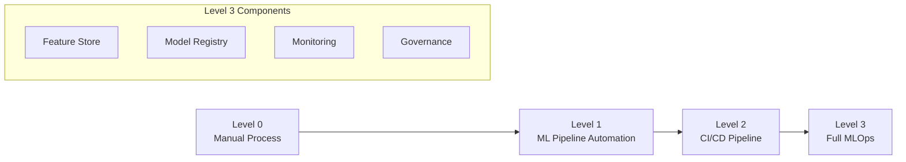
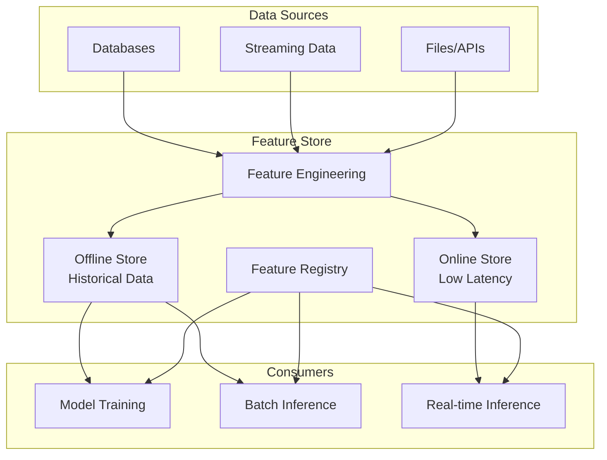
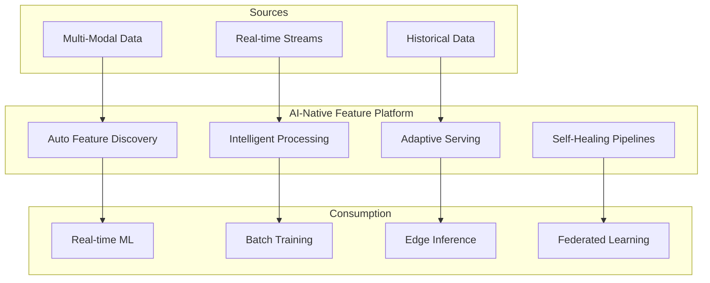

# Chapitre 10 : MLOps et Feature Stores avec Kafka

## Introduction

Le Machine Learning Operations (MLOps) et les Feature Stores représentent l'évolution naturelle des pratiques de data science vers des systèmes de production robustes et scalables. Apache Kafka joue un rôle central dans cette transformation, permettant la création de pipelines de données temps réel pour l'entraînement et l'inférence des modèles ML.

## Table des matières

1. [MLOps : Définition et Enjeux](#mlops-définition-et-enjeux)
2. [Feature Stores : La révolution des données ML](#feature-stores-la-révolution-des-données-ml)
3. [Kafka dans l'écosystème MLOps](#kafka-dans-lécosystème-mlops)
4. [Comparatif des solutions Feature Store](#comparatif-des-solutions-feature-store)
5. [Architectures de référence](#architectures-de-référence)
6. [Real-time Feature Engineering](#real-time-feature-engineering)
7. [Model Serving et Inference](#model-serving-et-inference)
8. [Observabilité et Data Quality](#observabilité-et-data-quality)
9. [Cas d'usage par secteur](#cas-dusage-par-secteur)
10. [Tendances 2025 et recommandations](#tendances-2025-et-recommandations)

---

## MLOps : Définition et Enjeux

### L'évolution vers MLOps

Le **MLOps** (Machine Learning Operations) vise à industrialiser le cycle de vie des modèles ML, de la conception à la production en passant par la maintenance. Selon une étude McKinsey 2024, 90% des projets ML n'atteignent jamais la production.

### Les défis du ML en production

**1. Data Pipeline Complexity**
- Gestion des données multi-sources
- Validation et qualité des données
- Feature drift et data drift

**2. Model Lifecycle Management**
- Versioning des modèles et des features
- Déploiement et rollback
- Monitoring et performance tracking

**3. Operational Challenges**
- Latence d'inférence
- Scalabilité et availability
- Governance et compliance

### MLOps Maturity Model



---

## Feature Stores : La révolution des données ML

### Qu'est-ce qu'un Feature Store ?

Un **Feature Store** est une plateforme centralisée qui gère le cycle de vie complet des features ML :

- **Feature Engineering** : Transformation et création de features
- **Feature Storage** : Stockage online et offline
- **Feature Serving** : Distribution pour training et inference
- **Feature Discovery** : Catalogage et réutilisation
- **Feature Monitoring** : Qualité et drift detection

### Problèmes résolus par les Feature Stores

**1. Feature Reusability**
- Réduction de la duplication de code
- Standardisation des transformations
- Accélération du time-to-market

**2. Training-Serving Skew**
- Garantie de cohérence online/offline
- Point-in-time correctness
- Feature versioning

**3. Data Governance**
- Lineage et provenance
- Access control et privacy
- Compliance et audit

### Architecture générale d'un Feature Store



---

## Kafka dans l'écosystème MLOps

### Kafka comme backbone MLOps

Apache Kafka joue plusieurs rôles critiques dans MLOps :

**1. Data Ingestion Hub**
- Collecte de données multi-sources
- Schema evolution avec Schema Registry
- Data validation et quality checks

**2. Feature Pipeline Orchestration**
- Stream processing pour feature engineering
- Real-time feature computation
- Event-driven feature updates

**3. Model Serving Infrastructure**
- Feature serving pour inference
- Model predictions streaming
- A/B testing et experimentation

### Pipeline MLOps avec Kafka

```python
from kafka import KafkaProducer, KafkaConsumer
from confluent_kafka import avro
import json

class MLOpsPipeline:
    def __init__(self):
        self.producer = KafkaProducer(
            bootstrap_servers=['localhost:9092'],
            value_serializer=lambda x: json.dumps(x).encode('utf-8')
        )
        
    def ingest_training_data(self, data_source):
        """Ingestion des données d'entraînement"""
        for record in data_source:
            # Validation et enrichissement
            validated_record = self.validate_record(record)
            
            # Publication vers Kafka
            self.producer.send('training-data', validated_record)
            
    def stream_features(self):
        """Streaming de features pour inference"""
        consumer = KafkaConsumer(
            'feature-requests',
            bootstrap_servers=['localhost:9092'],
            value_deserializer=lambda m: json.loads(m.decode('utf-8'))
        )
        
        for message in consumer:
            request = message.value
            features = self.compute_features(request)
            
            # Envoi des features calculées
            self.producer.send('computed-features', features)
```

### Integration avec Flink pour Feature Engineering

```python
from pyflink.datastream import StreamExecutionEnvironment
from pyflink.table import StreamTableEnvironment

class KafkaFlinkFeatureEngine:
    def __init__(self):
        self.env = StreamExecutionEnvironment.get_execution_environment()
        self.t_env = StreamTableEnvironment.create(self.env)
        
    def create_feature_pipeline(self):
        # Table source depuis Kafka
        self.t_env.execute_sql("""
            CREATE TABLE user_events (
                user_id BIGINT,
                event_type STRING,
                timestamp_col TIMESTAMP(3),
                amount DECIMAL(10,2),
                WATERMARK FOR timestamp_col AS timestamp_col - INTERVAL '5' SECOND
            ) WITH (
                'connector' = 'kafka',
                'topic' = 'user-events',
                'properties.bootstrap.servers' = 'localhost:9092',
                'format' = 'json'
            )
        """)
        
        # Feature computation avec fenêtres temporelles
        features_sql = """
            SELECT 
                user_id,
                COUNT(*) as event_count_1h,
                SUM(amount) as total_amount_1h,
                AVG(amount) as avg_amount_1h,
                TUMBLE_END(timestamp_col, INTERVAL '1' HOUR) as window_end
            FROM user_events
            WHERE event_type = 'purchase'
            GROUP BY user_id, TUMBLE(timestamp_col, INTERVAL '1' HOUR)
        """
        
        # Table sink vers Feature Store
        self.t_env.execute_sql("""
            CREATE TABLE feature_store_sink (
                user_id BIGINT,
                event_count_1h BIGINT,
                total_amount_1h DECIMAL(10,2),
                avg_amount_1h DECIMAL(10,2),
                window_end TIMESTAMP(3)
            ) WITH (
                'connector' = 'kafka',
                'topic' = 'user-features',
                'properties.bootstrap.servers' = 'localhost:9092',
                'format' = 'json'
            )
        """)
        
        # Exécution du pipeline
        self.t_env.sql_query(features_sql).insert_into('feature_store_sink')
```

---

## Comparatif des solutions Feature Store

### Landscape 2024-2025

Le marché des Feature Stores a considérablement évolué. Voici un comparatif détaillé des solutions principales :

#### Solutions Managed/Enterprise

| Solution | Type | Points forts | Limitations | Prix | Kafka Support |
|----------|------|-------------|-------------|------|---------------|
| **Tecton** | Managed | Performance, Enterprise-ready, Support 24/7 | Coût élevé, Lock-in | $$$ | Native |
| **Databricks Feature Store** | Platform | Intégration native Delta Lake/Spark | Lock-in, Azure/AWS only | $$ | Via Delta Lake |
| **SageMaker Feature Store** | AWS Managed | Intégration AWS native | AWS only, Limited features | $$ | Via Kinesis |
| **Vertex AI Feature Store** | GCP Managed | Intégration GCP native | GCP only, Nouveau | $$ | Via Pub/Sub |
| **Qwak** | Platform | MLOps complet | Nouveau sur le marché | $$ | Native |

#### Solutions Open Source

| Solution | Maturité | Points forts | Limitations | Maintenance | Kafka Support |
|----------|----------|-------------|-------------|-------------|---------------|
| **Feast** | Mature | Flexibilité, Grande communauté | Complexité opérationnelle | Self-managed | Native |
| **Hopsworks** | Mature | Features riches, Hybrid deployment | Courbe d'apprentissage | Managed/Self | Native |
| **Featureform** | Emerging | Architecture virtuelle, Simple | Nouveau, Ecosystem limité | Self-managed | Native |

#### Solutions Émergentes

| Solution | Innovation | Focus | Adoption |
|----------|------------|--------|----------|
| **Fennel** (acquis par Databricks) | Incremental processing | Real-time efficiency | Croissante |
| **Iguazio MLRun** | End-to-end MLOps | Platform complète | Niche |
| **Tecton Rift** | High-performance engine | Compute optimization | Nouvelle |

### Critères de sélection

**1. Critères techniques**
- Performance (latency, throughput)
- Scalabilité horizontale
- Support real-time et batch
- Integration ecosystem

**2. Critères opérationnels**
- Deployment model (Cloud, On-prem, Hybrid)
- Maintenance et support
- Monitoring et observabilité
- Security et compliance

**3. Critères business**
- Total Cost of Ownership (TCO)
- Time to value
- Vendor lock-in risk
- Roadmap et vision

### Recommandations par cas d'usage

**Startups/PME** : Feast + Kafka + Kubernetes
**Entreprises AWS** : SageMaker Feature Store + MSK
**Entreprises multi-cloud** : Tecton ou Hopsworks
**Organisations Databricks** : Databricks Feature Store

---

## Architectures de référence

### Architecture 1 : Feast + Kafka + Kubernetes

```yaml
# Architecture microservices avec Feast
apiVersion: v1
kind: ConfigMap
metadata:
  name: feast-config
data:
  feature_store.yaml: |
    project: ml_platform
    registry: s3://feast-registry/registry.db
    provider: kubernetes
    online_store:
      type: redis
      connection_string: redis://redis:6379
    offline_store:
      type: spark
      spark_conf:
        spark.eventLog.enabled: true
    stream_source:
      type: kafka
      kafka_bootstrap_servers: kafka:9092
```

```python
# Définition de features avec Feast
from feast import Entity, Feature, FeatureView, ValueType
from feast.data_sources import KafkaSource

# Entity definition
user = Entity(name="user", value_type=ValueType.INT64)

# Kafka source
user_events_source = KafkaSource(
    name="user_events",
    event_timestamp_column="timestamp",
    bootstrap_servers="kafka:9092",
    message_format={"json": {"json_format": "json"}},
    topic="user-events",
    created_timestamp_column="created_timestamp",
)

# Feature view
user_features = FeatureView(
    name="user_features",
    entities=["user"],
    ttl=timedelta(days=1),
    features=[
        Feature(name="transaction_count_1h", dtype=ValueType.INT64),
        Feature(name="total_amount_1h", dtype=ValueType.DOUBLE),
    ],
    online=True,
    source=user_events_source,
)
```

### Architecture 2 : Tecton Enterprise

```python
# Pipeline Tecton avec Kafka
from tecton import Entity, FeatureService, KafkaSource, transformation
from tecton.types import Field, Int64, Timestamp

@transformation
def user_transaction_features(transactions):
    return f"""
        SELECT
            user_id,
            COUNT(*) as transaction_count_1h,
            SUM(amount) as total_amount_1h,
            window_start_time
        FROM {transactions}
        WHERE timestamp >= window_start_time
        GROUP BY user_id, window_start_time
    """

# Kafka source
transactions_source = KafkaSource(
    name="transactions",
    topic="user-transactions",
    timestamp_field="timestamp",
    schema=[
        Field("user_id", Int64),
        Field("amount", Float64), 
        Field("timestamp", Timestamp)
    ]
)

# Feature service pour serving
user_feature_service = FeatureService(
    name="user_features_v1",
    features=[user_transaction_features]
)
```

### Architecture 3 : Databricks + Delta Lake

```python
# Pipeline Databricks avec Kafka
import pyspark.sql.functions as F
from delta.tables import DeltaTable

class DatabricksFeaturePipeline:
    def __init__(self, spark):
        self.spark = spark
        
    def create_streaming_features(self):
        # Read from Kafka
        kafka_df = (self.spark
            .readStream
            .format("kafka")
            .option("kafka.bootstrap.servers", "kafka:9092")
            .option("subscribe", "user-events")
            .load()
        )
        
        # Parse and transform
        parsed_df = (kafka_df
            .select(F.from_json(F.col("value").cast("string"), schema).alias("data"))
            .select("data.*")
            .withColumn("timestamp", F.current_timestamp())
        )
        
        # Windowed aggregations
        features_df = (parsed_df
            .groupBy(
                F.window(F.col("timestamp"), "1 hour"),
                F.col("user_id")
            )
            .agg(
                F.count("*").alias("event_count"),
                F.sum("amount").alias("total_amount")
            )
        )
        
        # Write to Delta Lake Feature Store
        query = (features_df
            .writeStream
            .format("delta")
            .outputMode("append")
            .option("checkpointLocation", "/tmp/checkpoint")
            .table("feature_store.user_features")
        )
        
        return query
```

---

## Real-time Feature Engineering

### Patterns de Feature Engineering temps réel

**1. Sliding Window Aggregations**
```python
class SlidingWindowFeatures:
    def __init__(self):
        self.env = StreamExecutionEnvironment.get_execution_environment()
        
    def create_sliding_features(self):
        # Source Kafka
        events = self.env.add_source(
            FlinkKafkaConsumer("events", EventSchema(), kafka_props)
        )
        
        # Sliding window features
        features = (events
            .key_by(lambda e: e.user_id)
            .window(SlidingEventTimeWindows.of(
                Time.hours(1),    # window size
                Time.minutes(5)   # slide interval
            ))
            .aggregate(FeatureAggregator())
        )
        
        return features

class FeatureAggregator(AggregateFunction):
    def create_accumulator(self):
        return {"count": 0, "sum": 0.0, "events": []}
        
    def add(self, value, accumulator):
        accumulator["count"] += 1
        accumulator["sum"] += value.amount
        accumulator["events"].append(value)
        return accumulator
        
    def get_result(self, accumulator):
        return {
            "user_id": accumulator["events"][0].user_id,
            "count_1h": accumulator["count"],
            "sum_1h": accumulator["sum"],
            "avg_1h": accumulator["sum"] / accumulator["count"],
            "latest_events": accumulator["events"][-5:]  # last 5 events
        }
```

**2. Complex Event Processing pour détection de patterns**
```python
from pyflink.cep import CEP, Pattern

def create_fraud_features():
    # Pattern de détection : transactions rapides de montants élevés
    fraud_pattern = (Pattern.begin("normal")
        .where(lambda event: event.amount < 100)
        .next("suspicious")
        .where(lambda event: event.amount > 1000) 
        .within(Time.minutes(5))
    )
    
    # Detection et création de features
    fraud_stream = CEP.pattern(
        transactions.key_by("user_id"),
        fraud_pattern
    ).select(create_fraud_features)
    
    return fraud_stream

def create_fraud_features(pattern_result):
    normal = pattern_result["normal"]
    suspicious = pattern_result["suspicious"]
    
    return {
        "user_id": normal.user_id,
        "fraud_score": calculate_fraud_score(normal, suspicious),
        "time_diff_minutes": (suspicious.timestamp - normal.timestamp).seconds / 60,
        "amount_ratio": suspicious.amount / normal.amount,
        "feature_type": "fraud_detection"
    }
```

**3. Real-time Embeddings et Vector Features**
```python
class RealTimeEmbeddingFeatures:
    def __init__(self):
        self.embedding_model = SentenceTransformer('all-MiniLM-L6-v2')
        self.vector_db = MilvusClient()
        
    def create_text_embeddings(self, text_stream):
        # Génération d'embeddings en temps réel
        embeddings = text_stream.map(
            lambda text: {
                "text": text.content,
                "embedding": self.embedding_model.encode(text.content).tolist(),
                "timestamp": text.timestamp
            }
        )
        
        # Recherche de similarité
        similar_features = embeddings.map(self.find_similar_content)
        
        return similar_features
        
    def find_similar_content(self, doc):
        # Recherche vectorielle pour features de similarité
        results = self.vector_db.search(
            vectors=[doc["embedding"]],
            limit=5,
            metric_type="COSINE"
        )
        
        return {
            **doc,
            "similar_docs": [r.id for r in results],
            "similarity_scores": [r.score for r in results],
            "avg_similarity": sum(r.score for r in results) / len(results)
        }
```

---

## Model Serving et Inference

### Architecture Model Serving avec Kafka

```python
class KafkaModelServing:
    def __init__(self):
        self.model_registry = MLflowClient()
        self.feature_store = FeatureStore()
        self.kafka_consumer = KafkaConsumer('inference-requests')
        self.kafka_producer = KafkaProducer('predictions')
        
    def serve_predictions(self):
        for message in self.kafka_consumer:
            request = json.loads(message.value)
            
            # 1. Feature retrieval
            features = self.feature_store.get_online_features(
                feature_service="user_features_v1",
                entities={"user_id": request["user_id"]}
            )
            
            # 2. Model inference
            model = self.model_registry.get_latest_model("fraud_detection")
            prediction = model.predict(features)
            
            # 3. Result publishing
            result = {
                "request_id": request["request_id"],
                "user_id": request["user_id"],
                "prediction": prediction.tolist(),
                "confidence": float(prediction.max()),
                "timestamp": time.time(),
                "model_version": model.version
            }
            
            self.kafka_producer.send('predictions', result)
```

### A/B Testing avec Kafka

```python
class ABTestingFramework:
    def __init__(self):
        self.experiment_config = ExperimentConfig()
        self.models = {
            "control": load_model("model_v1"),
            "treatment": load_model("model_v2")
        }
        
    def ab_test_inference(self, request):
        # Assignation du traffic
        variant = self.assign_variant(request["user_id"])
        
        # Inference selon le variant
        model = self.models[variant]
        prediction = model.predict(request["features"])
        
        # Logging pour analyse
        experiment_data = {
            "user_id": request["user_id"],
            "variant": variant,
            "prediction": prediction,
            "timestamp": time.time(),
            "experiment_id": "fraud_model_v2_test"
        }
        
        self.kafka_producer.send('experiment-data', experiment_data)
        
        return prediction
    
    def assign_variant(self, user_id):
        # Hash-based consistent assignment
        hash_value = hashlib.md5(str(user_id).encode()).hexdigest()
        return "treatment" if int(hash_value, 16) % 100 < 50 else "control"
```

---

## Observabilité et Data Quality

### Monitoring des Feature Pipelines

```python
class FeaturePipelineMonitoring:
    def __init__(self):
        self.metrics_client = PrometheusClient()
        self.alert_manager = AlertManager()
        
    def monitor_feature_quality(self, feature_stream):
        # Métriques de qualité
        quality_metrics = feature_stream.map(self.calculate_quality_metrics)
        
        # Détection de drift
        drift_alerts = quality_metrics.filter(self.detect_drift)
        
        # Actions sur alertes
        drift_alerts.add_sink(self.send_drift_alert)
        
        return quality_metrics
    
    def calculate_quality_metrics(self, feature_batch):
        metrics = {
            "completeness": self.calculate_completeness(feature_batch),
            "validity": self.calculate_validity(feature_batch), 
            "consistency": self.calculate_consistency(feature_batch),
            "freshness": self.calculate_freshness(feature_batch)
        }
        
        # Publication vers Prometheus
        for metric_name, value in metrics.items():
            self.metrics_client.gauge(f'feature_quality_{metric_name}').set(value)
            
        return metrics
    
    def detect_drift(self, metrics):
        # Détection basée sur des seuils et ML
        drift_score = self.drift_detector.calculate_drift(metrics)
        return drift_score > self.drift_threshold
```

### Data Quality Framework

```python
class DataQualityFramework:
    def __init__(self):
        self.rules_engine = QualityRulesEngine()
        self.lineage_tracker = DataLineageTracker()
        
    def validate_features(self, features):
        validation_results = []
        
        for feature in features:
            # Validation par règles métier
            business_rules = self.rules_engine.get_rules(feature.name)
            rule_results = [rule.validate(feature) for rule in business_rules]
            
            # Validation statistique
            stat_validation = self.validate_statistical_properties(feature)
            
            # Validation de lineage
            lineage_validation = self.lineage_tracker.validate_lineage(feature)
            
            validation_results.append({
                "feature_name": feature.name,
                "business_rules": rule_results,
                "statistical_validation": stat_validation,
                "lineage_validation": lineage_validation,
                "overall_score": self.calculate_overall_score(rule_results, stat_validation, lineage_validation)
            })
            
        return validation_results
```

---

## Cas d'usage par secteur

### 1. E-commerce : Recommandations temps réel

```python
class EcommerceRecommendationSystem:
    def __init__(self):
        self.feature_store = TectonFeatureStore()
        self.recommendation_model = load_model("recommendation_v3")
        
    def real_time_recommendations(self):
        # Stream d'événements utilisateur
        user_events = self.get_kafka_stream("user-events")
        
        # Feature engineering en temps réel
        user_features = (user_events
            .key_by("user_id")
            .window(TumblingEventTimeWindows.of(Time.minutes(5)))
            .aggregate(UserBehaviorAggregator())
        )
        
        # Enrichissement avec historical features
        enriched_features = user_features.map(self.enrich_with_history)
        
        # Génération de recommandations
        recommendations = enriched_features.map(self.generate_recommendations)
        
        # Publication pour serving
        recommendations.add_sink(KafkaSink("recommendations"))
        
        return recommendations
    
    def enrich_with_history(self, current_features):
        # Récupération des features historiques
        historical = self.feature_store.get_online_features(
            feature_service="user_historical_features",
            entities={"user_id": current_features["user_id"]}
        )
        
        return {**current_features, **historical}
```

### 2. Finance : Détection de fraude

```python
class FraudDetectionPipeline:
    def __init__(self):
        self.fraud_model = load_model("fraud_detection_v2")
        self.risk_scorer = RiskScorer()
        
    def real_time_fraud_detection(self):
        # Stream de transactions
        transactions = self.get_kafka_stream("transactions")
        
        # Feature engineering multi-niveau
        transaction_features = self.compute_transaction_features(transactions)
        user_features = self.compute_user_features(transactions)
        merchant_features = self.compute_merchant_features(transactions)
        
        # Fusion des features
        combined_features = (transaction_features
            .connect(user_features).map(merge_features)
            .connect(merchant_features).map(merge_features)
        )
        
        # Scoring de fraude
        fraud_scores = combined_features.map(self.score_fraud_risk)
        
        # Actions basées sur le score
        high_risk = fraud_scores.filter(lambda x: x.score > 0.8)
        high_risk.add_sink(FraudAlertSink())
        
        return fraud_scores
```

### 3. IoT Industriel : Maintenance prédictive

```python
class PredictiveMaintenanceSystem:
    def __init__(self):
        self.maintenance_model = load_model("predictive_maintenance_v1")
        self.anomaly_detector = AnomalyDetector()
        
    def create_maintenance_pipeline(self):
        # Données capteurs IoT via MQTT-Kafka bridge
        sensor_data = self.get_mqtt_kafka_stream("sensor-data")
        
        # Feature engineering pour signaux temporels
        signal_features = (sensor_data
            .key_by("machine_id")
            .window(SlidingEventTimeWindows.of(Time.hours(1), Time.minutes(10)))
            .aggregate(SignalAnalysisAggregator())
        )
        
        # Détection d'anomalies
        anomalies = signal_features.filter(self.anomaly_detector.is_anomaly)
        
        # Prédiction de maintenance
        maintenance_predictions = signal_features.map(
            self.predict_maintenance_need
        )
        
        # Alertes et actions
        urgent_maintenance = maintenance_predictions.filter(
            lambda x: x.urgency_score > 0.9
        )
        urgent_maintenance.add_sink(MaintenanceAlertSink())
        
        return maintenance_predictions
```

---

## Tendances 2025 et recommandations

### Évolutions technologiques majeures

**1. AI-Assisted Feature Engineering**
```python
# Nouveauté 2025 : Feature engineering assisté par IA
class AIAssistedFeatureEngineering:
    def __init__(self):
        self.feature_ai = FeatureEngineeringAI()
        
    def auto_generate_features(self, data_stream):
        # IA génère automatiquement des features pertinentes
        suggested_features = self.feature_ai.suggest_features(data_stream)
        
        # Validation et test automatiques
        validated_features = self.validate_features(suggested_features)
        
        # Déploiement automatique des meilleures features
        return self.deploy_best_features(validated_features)
```

**2. Serverless Feature Stores**
```yaml
# Trend 2025 : Feature Stores serverless
apiVersion: v1
kind: FeatureStore
metadata:
  name: serverless-features
spec:
  compute:
    type: serverless
    autoScale: true
    minInstances: 0
    maxInstances: 100
  storage:
    online: redis-serverless
    offline: iceberg-s3
```

**3. Multi-Modal Feature Engineering**
```python
class MultiModalFeatures:
    def __init__(self):
        self.text_model = load_model("text_encoder")
        self.image_model = load_model("image_encoder") 
        self.audio_model = load_model("audio_encoder")
        
    def create_unified_features(self, multi_modal_stream):
        # Traitement unifié de données multi-modales
        unified_features = multi_modal_stream.map(
            lambda data: {
                "text_embedding": self.text_model.encode(data.text),
                "image_embedding": self.image_model.encode(data.image),
                "audio_embedding": self.audio_model.encode(data.audio),
                "unified_embedding": self.create_unified_embedding(data)
            }
        )
        
        return unified_features
```

### Innovations émergentes

**1. Feature Stores Quantiques**
- Calcul quantique pour feature engineering complexe
- Optimisation combinatoire pour sélection de features

**2. Federated Feature Learning**
- Feature engineering distribué préservant la privacy
- Cross-organization feature sharing

**3. Neuromorphic Feature Processing**
- Hardware spécialisé pour feature computation
- Ultra-low latency edge computing

### Recommandations stratégiques

**Pour les organisations débutantes :**

1. **Commencer simple** : Kafka + Feast + PostgreSQL
2. **Focus sur les use cases high-value** : Recommandations, Fraud
3. **Automatiser progressivement** : CI/CD pour features

**Pour les organisations avancées :**

1. **Adopter l'approche Shift Left** : Processing au plus près des sources
2. **Investir dans l'observabilité** : Monitoring complet des pipelines
3. **Explorer l'IA générative** : Auto-feature engineering

**Architecture cible 2025 :**



### Métriques de succès MLOps

| Métrique | Objectif 2025 | Description |
|----------|---------------|-------------|
| **Time to Production** | < 2 semaines | Du POC au déploiement |
| **Feature Reusability** | > 60% | Features réutilisées cross-teams |
| **Model Performance Drift** | < 2% mensuel | Stabilité des modèles |
| **Feature Quality Score** | > 95% | Données de qualité production |
| **Inference Latency** | < 10ms p99 | Performance temps réel |
| **Cost per Prediction** | Réduction 30% | Optimisation économique |

---

## Conclusion

Le mariage entre MLOps et Feature Stores avec Apache Kafka représente l'avenir de l'IA en production. Les organisations qui maîtrisent cette stack technologique aujourd'hui seront les leaders de l'économie de l'IA demain.

**Points clés à retenir :**

1. **Les Feature Stores ne sont plus optionnels** pour le ML à l'échelle
2. **Kafka est le système nerveux** des architectures MLOps modernes  
3. **L'automatisation intelligente** remplace les processus manuels
4. **La qualité des données** détermine le succès des modèles ML
5. **L'observabilité end-to-end** est critique pour la production

L'évolution vers des systèmes ML autonomes et auto-adaptables nécessite une fondation solide basée sur des technologies éprouvées comme Kafka, complétées par les innovations émergentes en IA et edge computing.

---

*Ce chapitre couvre l'état de l'art des pratiques MLOps en 2024-2025, basé sur les retours d'expérience des entreprises les plus avancées dans le domaine.* 