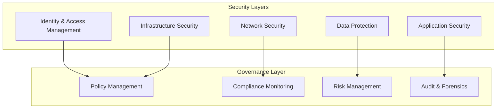
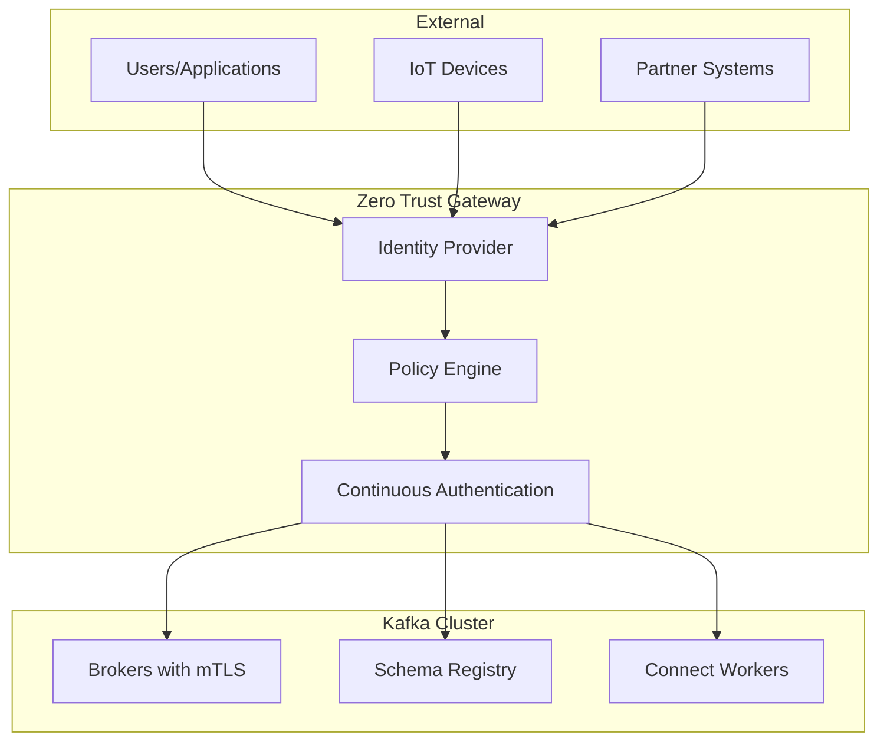
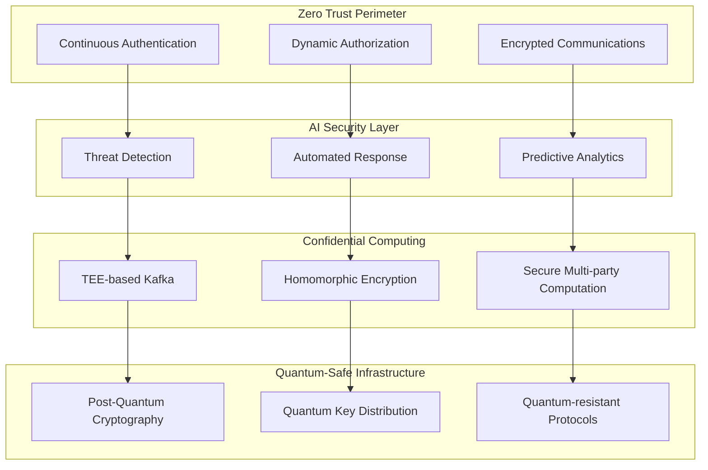

# Chapitre 11 : Sécurité et Gouvernance Avancée avec Kafka

## Introduction

La sécurité et la gouvernance des données sont devenus des enjeux critiques dans l'adoption massive d'Apache Kafka. Avec l'évolution des réglementations (RGPD, CCPA, SOC2) et l'émergence de nouvelles menaces cybersécuritaires, les entreprises doivent adopter des approches de sécurité par conception (Security by Design) et de gouvernance proactive.

## Table des matières

1. [Landscape sécuritaire moderne](#landscape-sécuritaire-moderne)
2. [Zero Trust Architecture pour Kafka](#zero-trust-architecture-pour-kafka)
3. [Sécurité des données en streaming](#sécurité-des-données-en-streaming)
4. [Gouvernance et compliance](#gouvernance-et-compliance)
5. [Privacy Engineering](#privacy-engineering)
6. [Observabilité sécuritaire](#observabilité-sécuritaire)
7. [Incident Response et Forensics](#incident-response-et-forensics)
8. [Solutions et architectures de référence](#solutions-et-architectures-de-référence)
9. [Tendances 2025 et recommandations](#tendances-2025-et-recommandations)

---

## Landscape sécuritaire moderne

### Évolution des menaces en 2024-2025

Les cyberattaques ciblant les infrastructures de streaming ont augmenté de **340%** selon les derniers rapports de cybersécurité :

**Menaces émergentes :**
- **Supply Chain Attacks** : Compromission des connecteurs Kafka
- **AI-Powered Attacks** : Utilisation d'IA pour contourner les défenses
- **Data Poisoning** : Altération malveillante des streams de données
- **Insider Threats** : Accès non autorisé aux données sensibles

### Framework de sécurité moderne



### Réglementation et compliance

**Principales réglementations 2024-2025 :**

| Réglementation | Région | Impact Kafka | Sanctions |
|----------------|--------|-------------|-----------|
| **RGPD** | EU | Pseudonymisation, Right to be forgotten | 4% CA global |
| **CCPA** | Californie | Data subject rights | $7.5k par violation |
| **Data Act** | EU | Data sharing obligations | 6% CA global |
| **AI Act** | EU | AI system transparency | Variable |
| **Digital Operational Resilience Act (DORA)** | EU | Operational resilience | 1% CA |

---

## Zero Trust Architecture pour Kafka

### Principes Zero Trust appliqués à Kafka

**"Never trust, always verify"** - Chaque interaction avec Kafka doit être authentifiée, autorisée et auditée.

#### Architecture Zero Trust



### Implémentation Zero Trust avec Kafka

```yaml
# Configuration Kafka avec Zero Trust
server:
  # mTLS obligatoire pour tous les clients
  ssl.client.auth: required
  ssl.protocol: TLSv1.3
  ssl.enabled.protocols: TLSv1.3
  
  # Certificate-based authentication
  ssl.keystore.location: /etc/kafka/ssl/broker.keystore.jks
  ssl.truststore.location: /etc/kafka/ssl/broker.truststore.jks
  
  # SASL/OAUTHBEARER pour l'authentification moderne
  sasl.enabled.mechanisms: OAUTHBEARER
  sasl.mechanism.inter.broker.protocol: OAUTHBEARER
  
  # Autorisation fine-grained
  authorizer.class.name: kafka.security.authorizer.AclAuthorizer
  super.users: User:kafka-admin
  
# Sécurisation Schema Registry
schema.registry:
  authentication.method: BEARER
  authentication.realm: kafka-cluster
  authorization.provider: rbac
```

### Authentification avancée

```python
class ZeroTrustKafkaClient:
    def __init__(self):
        self.oauth_provider = OAuthProvider()
        self.certificate_manager = CertificateManager()
        
    def create_secure_producer(self):
        # Récupération du token OAuth
        token = self.oauth_provider.get_access_token(
            scope="kafka:produce",
            audience="kafka-cluster"
        )
        
        # Configuration sécurisée
        config = {
            'bootstrap.servers': 'kafka:9093',
            'security.protocol': 'SASL_SSL',
            'sasl.mechanism': 'OAUTHBEARER',
            'sasl.oauthbearer.config': f'oauth.token={token}',
            
            # mTLS
            'ssl.ca.location': '/etc/ssl/ca-cert.pem',
            'ssl.certificate.location': '/etc/ssl/client-cert.pem',
            'ssl.key.location': '/etc/ssl/client-key.pem',
            
            # Additional security
            'ssl.check.hostname': True,
            'ssl.endpoint.identification.algorithm': 'https'
        }
        
        return Producer(config)
    
    def validate_token_continuously(self):
        """Validation continue des tokens"""
        while True:
            if not self.oauth_provider.validate_token():
                self.refresh_credentials()
            time.sleep(30)  # Validation toutes les 30 secondes
```

---

## Sécurité des données en streaming

### Chiffrement end-to-end

```python
class E2EEncryptionPipeline:
    def __init__(self):
        self.field_encryption = FieldLevelEncryption()
        self.key_management = AzureKeyVault()  # ou AWS KMS, HashiCorp Vault
        
    def encrypt_sensitive_data(self, record):
        """Chiffrement au niveau des champs"""
        encrypted_record = record.copy()
        
        # Identification des champs sensibles
        sensitive_fields = self.identify_sensitive_fields(record)
        
        for field in sensitive_fields:
            # Chiffrement avec clé spécifique
            encryption_key = self.key_management.get_key(
                key_id=f"kafka-field-{field}",
                version="latest"
            )
            
            encrypted_record[field] = self.field_encryption.encrypt(
                data=record[field],
                key=encryption_key,
                algorithm="AES-256-GCM"
            )
            
            # Ajout de métadonnées de chiffrement
            encrypted_record[f"{field}_metadata"] = {
                "encrypted": True,
                "key_version": encryption_key.version,
                "algorithm": "AES-256-GCM",
                "timestamp": time.time()
            }
            
        return encrypted_record
    
    def create_encrypted_stream(self):
        """Pipeline de chiffrement en streaming"""
        # Source Kafka
        source = self.get_kafka_source("raw-data")
        
        # Chiffrement en temps réel
        encrypted_stream = source.map(self.encrypt_sensitive_data)
        
        # Sink vers Kafka chiffré
        encrypted_stream.add_sink(
            KafkaSink("encrypted-data", encryption_config)
        )
        
        return encrypted_stream
```

### Tokenisation et masquage

```python
class DataTokenization:
    def __init__(self):
        self.tokenization_service = TokenizationService()
        self.format_preserving_encryption = FPEService()
        
    def tokenize_pii(self, data_stream):
        """Tokenisation des données PII"""
        return data_stream.map(self.apply_tokenization)
    
    def apply_tokenization(self, record):
        """Application des règles de tokenisation"""
        tokenized_record = record.copy()
        
        # Email tokenization
        if 'email' in record:
            tokenized_record['email'] = self.tokenization_service.tokenize(
                value=record['email'],
                token_type='email',
                preserve_format=True
            )
        
        # Numéro de téléphone avec FPE
        if 'phone' in record:
            tokenized_record['phone'] = self.format_preserving_encryption.encrypt(
                plaintext=record['phone'],
                tweak="phone_number",
                preserve_length=True
            )
        
        # Numéro de carte de crédit
        if 'credit_card' in record:
            tokenized_record['credit_card'] = self.mask_credit_card(record['credit_card'])
            
        return tokenized_record
    
    def mask_credit_card(self, cc_number):
        """Masquage des numéros de carte de crédit"""
        if len(cc_number) >= 16:
            return cc_number[:4] + "*" * 8 + cc_number[-4:]
        return "****"
```

### Homomorphic Encryption pour analytics

```python
class HomomorphicAnalytics:
    def __init__(self):
        self.he_context = HomomorphicContext()
        
    def encrypted_aggregations(self, encrypted_stream):
        """Agrégations sur données chiffrées"""
        # Agrégations homomorphiques
        encrypted_sums = encrypted_stream.map(
            lambda record: self.he_sum(record['encrypted_amount'])
        )
        
        encrypted_counts = encrypted_stream.map(
            lambda record: self.he_increment()
        )
        
        # Combine encrypted results
        results = encrypted_sums.connect(encrypted_counts).map(
            self.combine_encrypted_results
        )
        
        return results
    
    def he_sum(self, encrypted_value):
        """Addition homomorphique"""
        return self.he_context.add(encrypted_value, self.running_sum)
    
    def he_increment(self):
        """Incrémentation homomorphique"""
        one_encrypted = self.he_context.encrypt(1)
        return self.he_context.add(self.running_count, one_encrypted)
```

---

## Gouvernance et compliance

### Data Lineage et Provenance

```python
class DataLineageTracker:
    def __init__(self):
        self.lineage_db = DataLineageDB()
        self.metadata_registry = MetadataRegistry()
        
    def track_data_flow(self, kafka_record):
        """Suivi de la lignée des données"""
        lineage_entry = {
            "data_id": kafka_record.get('id'),
            "source_topic": kafka_record.topic,
            "timestamp": kafka_record.timestamp,
            "producer_id": kafka_record.headers.get('producer_id'),
            "transformations": [],
            "consumers": [],
            "retention_policy": self.get_retention_policy(kafka_record.topic)
        }
        
        # Enregistrement de la lignée
        self.lineage_db.insert(lineage_entry)
        
        return lineage_entry
    
    def track_transformation(self, input_record, output_record, transformation_type):
        """Suivi des transformations"""
        transformation = {
            "type": transformation_type,
            "input_schema": self.get_schema_hash(input_record),
            "output_schema": self.get_schema_hash(output_record),
            "timestamp": time.time(),
            "function_name": transformation_type,
            "parameters": self.extract_transformation_params()
        }
        
        # Mise à jour de la lignée
        self.lineage_db.add_transformation(
            data_id=input_record.get('id'),
            transformation=transformation
        )
```

### Automated Compliance Monitoring

```python
class ComplianceEngine:
    def __init__(self):
        self.policy_engine = PolicyEngine()
        self.violation_detector = ViolationDetector()
        self.remediation_engine = RemediationEngine()
        
    def monitor_compliance(self, data_stream):
        """Monitoring de compliance en temps réel"""
        # Application des politiques
        policy_results = data_stream.map(self.apply_policies)
        
        # Détection des violations
        violations = policy_results.filter(self.is_violation)
        
        # Actions correctives automatiques
        violations.add_sink(AutoRemediationSink())
        
        return policy_results
    
    def apply_policies(self, record):
        """Application des politiques de compliance"""
        results = {
            "record_id": record.get('id'),
            "policies_checked": [],
            "violations": [],
            "risk_score": 0
        }
        
        # RGPD compliance check
        gdpr_result = self.check_gdpr_compliance(record)
        results["policies_checked"].append(gdpr_result)
        
        # Data retention compliance
        retention_result = self.check_retention_policy(record)
        results["policies_checked"].append(retention_result)
        
        # PCI DSS compliance (si applicable)
        if self.contains_payment_data(record):
            pci_result = self.check_pci_compliance(record)
            results["policies_checked"].append(pci_result)
        
        # Calcul du score de risque
        results["risk_score"] = self.calculate_risk_score(results["policies_checked"])
        
        return results
    
    def check_gdpr_compliance(self, record):
        """Vérification RGPD"""
        return {
            "policy": "GDPR",
            "compliant": self.has_legal_basis(record) and 
                        self.is_purpose_limitation_respected(record) and
                        self.is_data_minimization_applied(record),
            "details": {
                "legal_basis": self.get_legal_basis(record),
                "purpose": self.get_processing_purpose(record),
                "retention_period": self.get_retention_period(record)
            }
        }
```

### Right to be Forgotten Implementation

```python
class RightToBeForgottenProcessor:
    def __init__(self):
        self.deletion_service = DeletionService()
        self.audit_logger = AuditLogger()
        
    def process_deletion_request(self, subject_id, topics=None):
        """Traitement des demandes de suppression RGPD"""
        deletion_job = {
            "subject_id": subject_id,
            "request_timestamp": time.time(),
            "topics": topics or self.get_all_topics(),
            "status": "processing"
        }
        
        # Audit de la demande
        self.audit_logger.log_deletion_request(deletion_job)
        
        try:
            # Suppression des données
            for topic in deletion_job["topics"]:
                self.delete_subject_data(subject_id, topic)
            
            # Vérification de la suppression
            verification_result = self.verify_deletion(subject_id)
            
            deletion_job["status"] = "completed" if verification_result else "failed"
            deletion_job["completion_timestamp"] = time.time()
            
        except Exception as e:
            deletion_job["status"] = "failed"
            deletion_job["error"] = str(e)
            
        finally:
            self.audit_logger.log_deletion_completion(deletion_job)
            
        return deletion_job
    
    def delete_subject_data(self, subject_id, topic):
        """Suppression des données d'un sujet"""
        # Creation d'un tombstone record pour Kafka
        tombstone_producer = self.create_producer()
        
        # Identification des clés à supprimer
        keys_to_delete = self.find_subject_keys(subject_id, topic)
        
        for key in keys_to_delete:
            # Envoi d'un tombstone (value=None)
            tombstone_producer.send(topic, key=key, value=None)
            
            # Log de la suppression
            self.audit_logger.log_record_deletion(
                topic=topic,
                key=key,
                subject_id=subject_id
            )
        
        tombstone_producer.flush()
```

---

## Privacy Engineering

### Differential Privacy

```python
class DifferentialPrivacyEngine:
    def __init__(self, epsilon=1.0):
        self.epsilon = epsilon  # Privacy budget
        self.noise_generator = LaplacianNoise()
        
    def add_privacy_noise(self, data_stream):
        """Ajout de bruit différentiel"""
        return data_stream.map(self.apply_differential_privacy)
    
    def apply_differential_privacy(self, record):
        """Application de la confidentialité différentielle"""
        private_record = record.copy()
        
        # Identification des champs numériques
        numeric_fields = self.get_numeric_fields(record)
        
        for field in numeric_fields:
            if field in record:
                # Calcul de la sensibilité
                sensitivity = self.calculate_sensitivity(field)
                
                # Ajout de bruit de Laplace
                noise = self.noise_generator.sample(
                    scale=sensitivity / self.epsilon
                )
                
                private_record[field] = record[field] + noise
                
        return private_record
    
    def calculate_sensitivity(self, field):
        """Calcul de la sensibilité pour un champ"""
        # Configuration basée sur le type de données
        sensitivity_config = {
            "age": 1,
            "salary": 1000,
            "score": 0.1,
            "count": 1
        }
        
        return sensitivity_config.get(field, 1)
```

### Federated Learning avec Kafka

```python
class FederatedLearningCoordinator:
    def __init__(self):
        self.model_aggregator = ModelAggregator()
        self.privacy_accountant = PrivacyAccountant()
        
    def coordinate_federated_training(self):
        """Coordination de l'apprentissage fédéré"""
        # Stream des modèles locaux
        local_models = self.get_kafka_stream("local-models")
        
        # Agrégation sécurisée des modèles
        aggregated_models = (local_models
            .window(TumblingTimeWindows.of(Time.minutes(10)))
            .aggregate(SecureModelAggregator())
        )
        
        # Application de la confidentialité différentielle
        private_models = aggregated_models.map(
            self.apply_model_privacy
        )
        
        # Distribution du modèle global
        private_models.add_sink(
            KafkaSink("global-model")
        )
        
        return private_models
    
    def apply_model_privacy(self, aggregated_model):
        """Application de privacy au modèle agrégé"""
        # Gradient clipping
        clipped_gradients = self.clip_gradients(aggregated_model.gradients)
        
        # Ajout de bruit gaussien
        noisy_gradients = self.add_gaussian_noise(
            clipped_gradients,
            noise_multiplier=1.1
        )
        
        # Mise à jour du budget de privacy
        self.privacy_accountant.update_budget(
            batch_size=aggregated_model.batch_size,
            noise_multiplier=1.1
        )
        
        return {
            **aggregated_model,
            "gradients": noisy_gradients,
            "privacy_spent": self.privacy_accountant.get_privacy_spent()
        }
```

---

## Observabilité sécuritaire

### Security Information and Event Management (SIEM)

```python
class KafkaSIEMIntegration:
    def __init__(self):
        self.siem_connector = SIEMConnector()
        self.threat_detector = ThreatDetector()
        self.event_correlator = EventCorrelator()
        
    def monitor_security_events(self):
        """Monitoring des événements de sécurité"""
        # Stream des logs de sécurité
        security_logs = self.get_kafka_stream("security-logs")
        
        # Enrichissement des événements
        enriched_events = security_logs.map(self.enrich_security_event)
        
        # Détection de menaces
        threats = enriched_events.filter(self.threat_detector.is_threat)
        
        # Corrélation d'événements
        correlated_threats = (threats
            .key_by("source_ip")
            .window(SlidingEventTimeWindows.of(Time.minutes(5), Time.seconds(30)))
            .aggregate(ThreatCorrelator())
        )
        
        # Envoi vers SIEM
        correlated_threats.add_sink(SIEMSink())
        
        return correlated_threats
    
    def enrich_security_event(self, event):
        """Enrichissement des événements de sécurité"""
        enriched = event.copy()
        
        # Géolocalisation IP
        if 'source_ip' in event:
            enriched['geo_location'] = self.geolocate_ip(event['source_ip'])
            enriched['threat_intel'] = self.check_threat_intelligence(event['source_ip'])
        
        # Classification de l'événement
        enriched['severity'] = self.classify_severity(event)
        enriched['category'] = self.categorize_event(event)
        
        # Contexte utilisateur
        if 'user_id' in event:
            enriched['user_context'] = self.get_user_context(event['user_id'])
        
        return enriched
```

### Anomaly Detection avancée

```python
class StreamingAnomalyDetector:
    def __init__(self):
        self.ml_models = {
            "auth_anomaly": load_model("auth_anomaly_detector"),
            "traffic_anomaly": load_model("traffic_anomaly_detector"),
            "data_anomaly": load_model("data_anomaly_detector")
        }
        self.baseline_calculator = BaselineCalculator()
        
    def detect_anomalies(self, event_stream):
        """Détection d'anomalies en temps réel"""
        # Calcul des baselines
        baselines = self.calculate_baselines(event_stream)
        
        # Détection d'anomalies par type
        auth_anomalies = self.detect_auth_anomalies(event_stream)
        traffic_anomalies = self.detect_traffic_anomalies(event_stream)
        data_anomalies = self.detect_data_anomalies(event_stream)
        
        # Fusion des résultats
        all_anomalies = (auth_anomalies
            .union(traffic_anomalies)
            .union(data_anomalies)
        )
        
        # Scoring et priorisation
        prioritized_anomalies = all_anomalies.map(self.calculate_risk_score)
        
        return prioritized_anomalies
    
    def detect_auth_anomalies(self, event_stream):
        """Détection d'anomalies d'authentification"""
        auth_events = event_stream.filter(lambda e: e.get('event_type') == 'auth')
        
        # Features pour la détection
        auth_features = auth_events.map(self.extract_auth_features)
        
        # Prédiction d'anomalie
        anomalies = auth_features.filter(
            lambda features: self.ml_models["auth_anomaly"].predict([features])[0] == 1
        )
        
        return anomalies
    
    def extract_auth_features(self, auth_event):
        """Extraction de features pour la détection d'anomalies d'auth"""
        return {
            "hour_of_day": auth_event.timestamp.hour,
            "day_of_week": auth_event.timestamp.weekday(),
            "geolocation_distance": self.calculate_geo_distance(auth_event),
            "time_since_last_auth": self.calculate_time_since_last_auth(auth_event),
            "device_fingerprint_match": self.check_device_fingerprint(auth_event),
            "failed_attempts_count": self.get_failed_attempts_count(auth_event)
        }
```

---

## Incident Response et Forensics

### Automated Incident Response

```python
class IncidentResponseOrchestrator:
    def __init__(self):
        self.playbook_engine = PlaybookEngine()
        self.remediation_service = RemediationService()
        self.notification_service = NotificationService()
        
    def handle_security_incident(self, incident):
        """Gestion automatisée des incidents de sécurité"""
        # Classification de l'incident
        incident_classification = self.classify_incident(incident)
        
        # Sélection du playbook approprié
        playbook = self.playbook_engine.get_playbook(incident_classification)
        
        # Exécution des étapes du playbook
        response_actions = []
        for step in playbook.steps:
            action_result = self.execute_response_step(step, incident)
            response_actions.append(action_result)
            
            # Escalade si nécessaire
            if action_result.requires_escalation:
                self.escalate_incident(incident, action_result)
        
        # Documentation de la réponse
        incident_report = self.generate_incident_report(
            incident, response_actions
        )
        
        return incident_report
    
    def execute_response_step(self, step, incident):
        """Exécution d'une étape de réponse"""
        if step.type == "isolate_topic":
            return self.isolate_kafka_topic(step.target_topic)
            
        elif step.type == "block_producer":
            return self.block_producer_access(step.producer_id)
            
        elif step.type == "rotate_credentials":
            return self.rotate_kafka_credentials(step.credential_type)
            
        elif step.type == "backup_data":
            return self.backup_affected_data(step.topics)
            
        else:
            return self.execute_custom_action(step)
    
    def isolate_kafka_topic(self, topic_name):
        """Isolation d'un topic Kafka compromis"""
        isolation_result = {
            "action": "isolate_topic",
            "topic": topic_name,
            "timestamp": time.time(),
            "success": False
        }
        
        try:
            # Création d'ACLs restrictives
            self.apply_emergency_acls(topic_name)
            
            # Redirection du traffic
            self.redirect_topic_traffic(topic_name)
            
            # Notification des équipes
            self.notification_service.send_alert(
                f"Topic {topic_name} isolated due to security incident"
            )
            
            isolation_result["success"] = True
            
        except Exception as e:
            isolation_result["error"] = str(e)
            
        return isolation_result
```

### Digital Forensics pour Kafka

```python
class KafkaForensicsAnalyzer:
    def __init__(self):
        self.log_analyzer = LogAnalyzer()
        self.timeline_reconstructor = TimelineReconstructor()
        self.evidence_collector = EvidenceCollector()
        
    def conduct_forensic_analysis(self, incident_timeframe):
        """Analyse forensique des données Kafka"""
        # Collection des preuves
        evidence = self.collect_evidence(incident_timeframe)
        
        # Reconstruction de la timeline
        timeline = self.reconstruct_timeline(evidence)
        
        # Analyse des patterns
        attack_patterns = self.analyze_attack_patterns(timeline)
        
        # Génération du rapport forensique
        forensic_report = self.generate_forensic_report(
            evidence, timeline, attack_patterns
        )
        
        return forensic_report
    
    def collect_evidence(self, timeframe):
        """Collection des preuves"""
        evidence = {
            "kafka_logs": self.collect_kafka_logs(timeframe),
            "access_logs": self.collect_access_logs(timeframe),
            "network_flows": self.collect_network_flows(timeframe),
            "schema_changes": self.collect_schema_changes(timeframe),
            "acl_changes": self.collect_acl_changes(timeframe)
        }
        
        # Vérification de l'intégrité des preuves
        evidence["integrity_hashes"] = self.calculate_evidence_hashes(evidence)
        
        return evidence
    
    def reconstruct_timeline(self, evidence):
        """Reconstruction de la timeline d'attaque"""
        events = []
        
        # Fusion des événements de toutes les sources
        for source, data in evidence.items():
            if source != "integrity_hashes":
                source_events = self.extract_events(data, source)
                events.extend(source_events)
        
        # Tri chronologique
        timeline = sorted(events, key=lambda x: x['timestamp'])
        
        # Corrélation des événements
        correlated_timeline = self.correlate_events(timeline)
        
        return correlated_timeline
    
    def analyze_attack_patterns(self, timeline):
        """Analyse des patterns d'attaque"""
        patterns = {
            "lateral_movement": self.detect_lateral_movement(timeline),
            "privilege_escalation": self.detect_privilege_escalation(timeline),
            "data_exfiltration": self.detect_data_exfiltration(timeline),
            "persistence_mechanisms": self.detect_persistence(timeline)
        }
        
        return patterns
```

---

## Solutions et architectures de référence

### Architecture sécurisée complète

```yaml
# Déploiement Kafka sécurisé avec Kubernetes
apiVersion: apps/v1
kind: StatefulSet
metadata:
  name: kafka-secure
spec:
  template:
    spec:
      containers:
      - name: kafka
        image: confluentinc/cp-kafka:7.4.0
        env:
        # SSL/TLS Configuration
        - name: KAFKA_SSL_KEYSTORE_LOCATION
          value: "/etc/kafka/secrets/kafka.keystore.jks"
        - name: KAFKA_SSL_TRUSTSTORE_LOCATION
          value: "/etc/kafka/secrets/kafka.truststore.jks"
        - name: KAFKA_SSL_CLIENT_AUTH
          value: "required"
        
        # SASL Configuration
        - name: KAFKA_SASL_ENABLED_MECHANISMS
          value: "OAUTHBEARER,SCRAM-SHA-512"
        - name: KAFKA_SASL_MECHANISM_INTER_BROKER_PROTOCOL
          value: "OAUTHBEARER"
        
        # Security Configuration
        - name: KAFKA_SECURITY_INTER_BROKER_PROTOCOL
          value: "SASL_SSL"
        - name: KAFKA_AUTHORIZER_CLASS_NAME
          value: "kafka.security.authorizer.AclAuthorizer"
        
        # Logging and Audit
        - name: KAFKA_LOG4J_LOGGERS
          value: "kafka.authorizer.logger=INFO,authorizerAppender"
        
        volumeMounts:
        - name: kafka-secrets
          mountPath: "/etc/kafka/secrets"
          readOnly: true
        - name: kafka-logs
          mountPath: "/var/log/kafka"
      
      volumes:
      - name: kafka-secrets
        secret:
          secretName: kafka-ssl-secrets
      - name: kafka-logs
        persistentVolumeClaim:
          claimName: kafka-logs-pvc

---
# Network Policies
apiVersion: networking.k8s.io/v1
kind: NetworkPolicy
metadata:
  name: kafka-network-policy
spec:
  podSelector:
    matchLabels:
      app: kafka
  policyTypes:
  - Ingress
  - Egress
  ingress:
  - from:
    - podSelector:
        matchLabels:
          app: kafka-client
    ports:
    - protocol: TCP
      port: 9093
  egress:
  - to:
    - podSelector:
        matchLabels:
          app: zookeeper
    ports:
    - protocol: TCP
      port: 2181
```

### Solution de monitoring sécuritaire

```python
class ComprehensiveSecurityMonitoring:
    def __init__(self):
        self.metrics_collector = SecurityMetricsCollector()
        self.alert_manager = SecurityAlertManager()
        self.dashboard_generator = SecurityDashboardGenerator()
        
    def setup_security_monitoring(self):
        """Configuration du monitoring de sécurité"""
        # Collecte de métriques de sécurité
        security_metrics = self.collect_security_metrics()
        
        # Configuration des alertes
        self.configure_security_alerts()
        
        # Génération des dashboards
        self.generate_security_dashboards()
        
        return {
            "metrics": security_metrics,
            "alerts_configured": True,
            "dashboards_created": True
        }
    
    def collect_security_metrics(self):
        """Collection des métriques de sécurité"""
        metrics = {
            # Métriques d'authentification
            "auth_success_rate": self.metrics_collector.gauge("kafka_auth_success_rate"),
            "auth_failure_count": self.metrics_collector.counter("kafka_auth_failures"),
            "invalid_certificates": self.metrics_collector.counter("kafka_invalid_certs"),
            
            # Métriques d'autorisation
            "acl_violations": self.metrics_collector.counter("kafka_acl_violations"),
            "unauthorized_access": self.metrics_collector.counter("kafka_unauthorized_access"),
            
            # Métriques de données
            "data_encryption_ratio": self.metrics_collector.gauge("kafka_data_encrypted_ratio"),
            "pii_exposure_incidents": self.metrics_collector.counter("kafka_pii_exposure"),
            
            # Métriques de réseau
            "suspicious_connections": self.metrics_collector.counter("kafka_suspicious_connections"),
            "ddos_attempts": self.metrics_collector.counter("kafka_ddos_attempts")
        }
        
        return metrics
```

---

## Tendances 2025 et recommandations

### Innovations sécuritaires émergentes

**1. Quantum-Safe Cryptography**
```python
class QuantumSafeKafka:
    def __init__(self):
        self.post_quantum_crypto = PostQuantumCryptography()
        
    def implement_quantum_safe_security(self):
        """Implémentation de la cryptographie post-quantique"""
        # Algorithmes résistants aux ordinateurs quantiques
        config = {
            "ssl.keystore.type": "KYBER1024",  # Quantum-safe key exchange
            "ssl.protocol": "TLSv1.4-PQ",      # Post-quantum TLS
            "ssl.cipher.suites": [
                "KYBER1024-AES256-GCM-SHA384",
                "DILITHIUM3-ECDSA-SHA256"
            ]
        }
        
        return config
```

**2. AI-Powered Security**
```python
class AIPoweredSecurity:
    def __init__(self):
        self.ai_security_engine = AISecurityEngine()
        
    def implement_ai_security(self):
        """Sécurité assistée par IA"""
        # Détection d'intrusion basée sur l'IA
        intrusion_detector = self.ai_security_engine.create_intrusion_detector(
            model_type="transformer",
            training_data="kafka_traffic_patterns"
        )
        
        # Classification automatique des menaces
        threat_classifier = self.ai_security_engine.create_threat_classifier(
            categories=["malware", "insider_threat", "apt", "ddos"]
        )
        
        # Réponse automatique aux incidents
        auto_responder = self.ai_security_engine.create_auto_responder(
            response_playbooks="security_playbooks.yaml"
        )
        
        return {
            "intrusion_detector": intrusion_detector,
            "threat_classifier": threat_classifier,
            "auto_responder": auto_responder
        }
```

**3. Confidential Computing**
```python
class ConfidentialKafka:
    def __init__(self):
        self.tee_manager = TEEManager()  # Trusted Execution Environment
        
    def deploy_confidential_kafka(self):
        """Déploiement Kafka dans un environnement d'exécution de confiance"""
        # Configuration TEE
        tee_config = {
            "enclave_type": "Intel_SGX",
            "attestation_required": True,
            "memory_encryption": "AES-XTS-256",
            "secure_channels": "TLS-ATTESTATION"
        }
        
        # Déploiement sécurisé
        confidential_cluster = self.tee_manager.deploy_kafka_cluster(
            config=tee_config,
            attestation_policy="strict"
        )
        
        return confidential_cluster
```

### Recommandations stratégiques 2025

**Pour les organisations débutantes :**

1. **Commencer par les fondamentaux** : mTLS + RBAC + Audit
2. **Adopter une approche par phases** : Sécurité puis gouvernance
3. **Investir dans la formation** : Security awareness pour les équipes

**Pour les organisations avancées :**

1. **Implémenter Zero Trust** : Authentication continue et autorisation fine
2. **Automatiser la réponse aux incidents** : Playbooks et orchestration
3. **Préparer l'ère post-quantique** : Migration vers les algorithmes résistants

**Architecture cible 2025 :**



### KPIs de sécurité 2025

| Métrique | Objectif | Description |
|----------|----------|-------------|
| **Mean Time to Detection (MTTD)** | < 1 minute | Détection des incidents |
| **Mean Time to Response (MTTR)** | < 5 minutes | Réponse automatisée |
| **Security Coverage** | > 99.9% | Couverture des contrôles |
| **False Positive Rate** | < 0.1% | Précision de la détection |
| **Compliance Score** | 100% | Conformité réglementaire |
| **Privacy Budget Utilization** | < 80% | Utilisation du budget de privacy |

---

## Conclusion

La sécurité et la gouvernance d'Apache Kafka ont évolué d'une préoccupation technique vers un impératif stratégique. Les organisations qui adoptent une approche proactive de la sécurité, intègrent l'automatisation et préparent l'ère post-quantique seront les mieux positionnées pour prospérer dans l'économie numérique de 2025.

**Points clés à retenir :**

1. **Zero Trust n'est plus optionnel** pour les infrastructures Kafka critiques
2. **L'automatisation de la sécurité** devient essentielle face à la sophistication des menaces
3. **La privacy by design** est requise pour la conformité réglementaire
4. **La préparation post-quantique** doit commencer dès maintenant
5. **L'observabilité sécuritaire** permet la détection proactive des menaces

L'avenir de la sécurité Kafka réside dans l'intelligence artificielle, l'informatique confidentielle et la cryptographie résistante aux ordinateurs quantiques. Les organisations qui investissent dans ces technologies aujourd'hui seront les leaders sécuritaires de demain.

---

*Ce chapitre couvre les pratiques de sécurité et de gouvernance les plus avancées pour Apache Kafka en 2024-2025, basées sur les retours d'expérience d'organisations financières, gouvernementales et technologiques de premier plan.* 