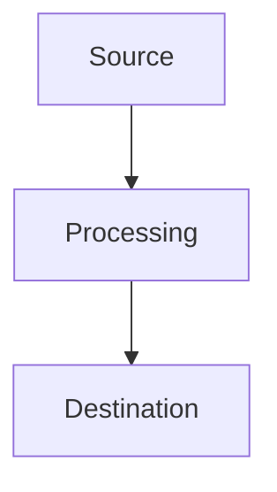

# 📐 Guide d'Harmonisation - Documentation Kafka

## Vue d'ensemble

Ce guide définit les standards de **structure**, **style** et **format** pour maintenir la cohérence à travers toute la documentation Apache Kafka. Chaque chapitre doit respecter ces conventions pour offrir une expérience de lecture uniforme.

---

## 🏗️ Structure Standardisée des Chapitres

### Template de Chapitre

```markdown
# Chapitre X : [Titre] - [Sous-titre descriptif]

## Introduction

[Description du chapitre en 2-3 paragraphes]
- Contexte et enjeux
- Positionnement dans l'écosystème
- Valeur ajoutée pour le lecteur

**Source(s) officielle(s) :** [liens vers documentation primaire]

## Table des matières

1. [Section 1](#section-1)
2. [Section 2](#section-2)
...
8. [Conclusion](#conclusion)

---

## [Sections principales]

### [Sous-sections avec exemples code]

### [Cas d'usage pratiques]

---

## Conclusion

[Synthèse des points clés]
[Recommandations stratégiques]
[Next steps pour le lecteur]

---

*Sources : [liste complète des références]*
```

### Éléments Obligatoires

**1. Header standardisé**
- Numéro de chapitre consistant
- Titre descriptif et accrocheur
- Introduction contextuelle (150-300 mots)

**2. Table des matières**
- Maximum 8-10 sections principales
- Liens anchor fonctionnels
- Progression logique du général au spécifique

**3. Sections techniques**
- Au moins 3 exemples de code par chapitre
- Diagrammes architecture (mermaid ou ASCII)
- Comparatifs tableaux quand pertinent

**4. Conclusion structurée**
- Points clés (3-5 bullets)
- Recommandations actionables
- Sources citées

---

## 🎨 Standards de Style

### Formatage du Texte

**Emphases :**
- **Gras** : Concepts clés, termes techniques importants
- *Italique* : Citations, noms de produits
- `Code inline` : Noms de fichiers, commandes, variables
- > Citations et avertissements importants

**Listes :**
- **Listes à puces** : Fonctionnalités, avantages
- **Listes numérotées** : Étapes de procédure
- **Tableaux** : Comparaisons détaillées

### Code et Exemples

**Blocs de code avec langage :**
```python
# Toujours spécifier le langage
class ExempleCode:
    def __init__(self):
        self.commentaires_en_francais = True
```

**Configuration YAML :**
```yaml
# Configuration avec commentaires explicites
configuration:
  parameter: "valeur_exemple"
  description: "Explication du paramètre"
```

**Commandes bash :**
```bash
# Commandes avec commentaires
kafka-topics --create \
  --topic exemple-topic \
  --partitions 3
```

### Diagrammes Architecture

**Mermaid préféré :**


**ASCII si nécessaire :**
```
┌─────────────┐    ┌─────────────┐    ┌─────────────┐
│   Source    │───►│ Processing  │───►│Destination  │
└─────────────┘    └─────────────┘    └─────────────┘
```

---

## 📊 Standards de Contenu

### Exemples Techniques

**Qualité des exemples :**
- **Testables** : Code fonctionnel et vérifiable
- **Pertinents** : Cas d'usage réels enterprise
- **Progressifs** : Du simple au complexe
- **Commentés** : Explications inline

**Structure type d'exemple :**
```python
class ExempleEnterprise:
    """
    Exemple représentatif d'un cas d'usage enterprise
    
    Cette classe illustre [concept spécifique] avec
    des bonnes pratiques production-ready.
    """
    
    def __init__(self):
        # Configuration enterprise-grade
        self.config = self.load_enterprise_config()
        
    def methode_principale(self):
        """Méthode illustrant le concept clé"""
        # Implémentation avec error handling
        try:
            result = self.business_logic()
            return result
        except Exception as e:
            # Logging approprié
            logger.error(f"Erreur: {e}")
            raise
```

### Tableaux Comparatifs

**Format standardisé :**

| Critère | Solution A | Solution B | Solution C |
|---------|------------|------------|------------|
| **Performance** | ⭐⭐⭐⭐⭐ | ⭐⭐⭐⭐ | ⭐⭐⭐ |
| **Simplicité** | ⭐⭐⭐ | ⭐⭐⭐⭐⭐ | ⭐⭐⭐⭐ |
| **Prix** | $$$ | $ | $$ |
| **Support** | 24/7 | Communauté | Business hours |

**Légende systématique :**
- ⭐ = Échelle de qualité (1-5 étoiles)
- $ = Échelle de prix ($ à $$$$)
- ✅ = Fonctionnalité disponible
- ❌ = Fonctionnalité absente
- 🔄 = En développement

---

## 🔗 Standards de Références

### Citations de Sources

**Format URLs :**
- **Documentation officielle** : [Nom Service](https://url-complete)
- **Articles techniques** : [Titre Article - Auteur](https://url)
- **Études de marché** : [Rapport - Organisme](https://url)

**Intégration dans le texte :**
- Selon [Gartner 2024](https://gartner.com/report), 80% des enterprises...
- La documentation [Apache Kafka](https://kafka.apache.org) précise que...

### Références Croisées

**Format interne :**
- Voir [Chapitre 3 - Concepts Techniques](./03-concepts-techniques.md)
- Référence section : [Installation Docker](#installation-docker)
- Cross-reference : Comme expliqué dans le [guide sécurité](./06-securite.md#authentification)

---

## 💡 Standards d'Innovation

### Intégration des Nouveautés

**Structure pour nouvelles technologies :**
1. **Contexte** : Pourquoi cette innovation ?
2. **Fonctionnement** : Comment ça marche ?
3. **Avantages** : Quels bénéfices ?
4. **Limitations** : Quelles contraintes ?
5. **Adoption** : Qui l'utilise ? Maturité ?
6. **Exemple pratique** : Code ou configuration

**Marquage temporal :**
- **Nouveauté 2024-2025** : `**[NOUVEAU 2025]**`
- **Tendance émergente** : `**[EMERGING]**`
- **Deprecated** : `**[DÉPRÉCIÉ]**`

### Prospective et Roadmaps

**Format roadmap :**
```yaml
Roadmap_Technologie:
  Q1_2025: "Fonctionnalité A - Statut: En développement"
  Q2_2025: "Fonctionnalité B - Statut: Alpha"
  Q3_2025: "Fonctionnalité C - Statut: Planifié"
  2026: "Vision long terme - Statut: R&D"
```

---

## 🎯 Guidelines Spécifiques par Type

### Chapitres Techniques (1-3, 9-11)

**Focus :**
- Profondeur technique maximale
- Exemples code nombreux (10+ par chapitre)
- Architecture diagrams détaillés
- Performance benchmarks

**Structure type :**
1. Concepts fondamentaux
2. Architecture détaillée
3. Exemples pratiques
4. Optimisations avancées
5. Troubleshooting
6. Best practices

### Chapitres Plateformes (4-5, 7)

**Focus :**
- Comparaisons objectives
- ROI et business case
- Cas d'usage concrets
- Migration strategies

**Structure type :**
1. Vue d'ensemble plateforme
2. Fonctionnalités clés
3. Architecture et déploiement
4. Cas d'usage par secteur
5. Comparaison concurrentielle
6. ROI et justification

### Chapitres Spécialisés (6, 8, 10-11)

**Focus :**
- Expertise domaine
- Compliance et réglementations
- Innovations émergentes
- Tendances futures

**Structure type :**
1. Enjeux et contexte
2. État de l'art actuel
3. Solutions et approches
4. Cas d'implémentation
5. Tendances et évolutions
6. Recommandations stratégiques

---

## ✅ Checklist Harmonisation

### Avant Publication

**Structure :**
- [ ] Header standardisé avec numéro chapitre
- [ ] Table des matières complète
- [ ] Introduction contextuelle (150-300 mots)
- [ ] Conclusion avec points clés

**Contenu :**
- [ ] Minimum 3 exemples de code commentés
- [ ] Au moins 1 diagramme architecture
- [ ] Tableau comparatif si pertinent
- [ ] Cas d'usage concret

**Style :**
- [ ] Formatage consistant (gras, italique, code)
- [ ] Liens fonctionnels (internes et externes)
- [ ] Sources citées en fin de chapitre
- [ ] Langue française correcte

**Technique :**
- [ ] Code testé et fonctionnel
- [ ] Références à jour (2024-2025)
- [ ] Cross-references correctes
- [ ] Markdown valide

### Après Mise à Jour

**Vérification globale :**
- [ ] Cohérence avec autres chapitres
- [ ] Pas de duplication de contenu
- [ ] Navigation fluide entre sections
- [ ] Actualité des informations

---

## 🔄 Processus de Maintenance

### Rythme de Révision

**Trimestriel :**
- Mise à jour technologies émergentes
- Refresh des liens et références
- Ajout nouveaux cas d'usage

**Annuel :**
- Révision complète structure
- Harmonisation cross-chapitres
- Benchmark concurrentiel
- Roadmap prospective

### Critères de Qualité

**Métriques de cohérence :**
- Temps de lecture similaire par chapitre (20-30 min)
- Nombre d'exemples equilibré (3-10 par chapitre)
- Profondeur technique adaptée au public
- Actualité des sources (< 18 mois)

---

## 📈 Evolution Continue

### Feedback Integration

**Sources de feedback :**
- Retours utilisateurs documentation
- Évolutions technologiques vendor
- Nouvelles réglementations
- Benchmarks performance

**Process d'amélioration :**
1. **Collection** feedback mensuel
2. **Priorisation** par impact/effort
3. **Implémentation** par batch trimestriel
4. **Validation** qualité avant publication

---

**Ce guide assure la cohérence, qualité et pertinence de l'ensemble de la documentation Apache Kafka 2024-2025.**

*Dernière mise à jour : Janvier 2025* 